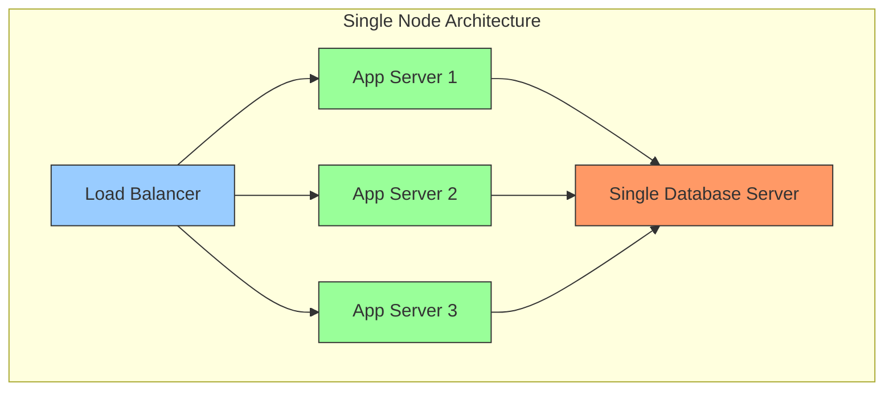
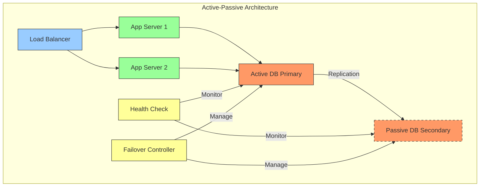
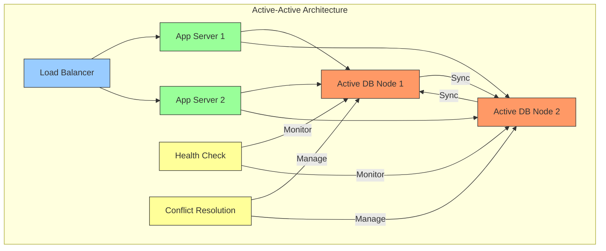

# High Availability Architecture Guide

## Table of Contents
1. [Introduction](#introduction)
2. [Common Interview Questions](#common-interview-questions)
3. [Single Node Database Architecture](#single-node-database-architecture)
4. [Multi-Node Database Architecture](#multi-node-database-architecture)
   - [Active-Passive Architecture](#active-passive-architecture)
   - [Active-Active Architecture](#active-active-architecture)
5. [Comparison and Decision Making](#comparison-and-decision-making)

## Introduction

High Availability (HA) is a characteristic of a system that aims to ensure an agreed level of operational performance, usually uptime, for a higher than normal period. When designing systems that require 99.999% availability (five nines), understanding different architectural patterns becomes crucial.

## Common Interview Questions

The same architectural concept might be asked in different ways during system design interviews:

1. "Design a High Availability Architecture"
2. "Design an Architecture to achieve 99.999% availability"
3. "Design an architecture to avoid single point of failure"
4. "Explain active-active and active-passive architectures"
5. "How would you ensure system availability during database failures?"

## Single Node Database Architecture

### Overview

The simplest form of database architecture with a single database server handling all operations.

### Components
- Single Database Server
- Application Servers
- Load Balancer (optional)

### Pros
1. Simple to set up and maintain
2. No data synchronization complexity
3. ACID properties are easier to maintain
4. Lower infrastructure costs
5. No network latency between database nodes

### Cons
1. Single Point of Failure (SPOF)
2. Limited scalability
3. Maintenance requires downtime
4. No failover capability
5. Resource limitations of a single machine

### Use Cases
- Development environments
- Small applications with low traffic
- Non-critical systems
- Budget-constrained projects

## Multi-Node Database Architecture

### Active-Passive Architecture

#### Overview

In this setup, one database server (active) handles all operations while another server (passive) stands by as a backup.

#### Components
- Active Database Node
- Passive Database Node(s)
- Replication Mechanism
- Failover Controller
- Health Monitoring System

#### How It Works
1. Active node handles all read/write operations
2. Data is replicated to passive node(s)
3. Health monitoring system checks active node status
4. On failure, failover controller promotes passive to active
5. DNS/Load Balancer redirects traffic to new active node

#### Examples
1. **MySQL with Primary-Secondary Replication**
   - Primary handles writes
   - Secondary maintains replica
   - Automatic failover with MySQL Group Replication

2. **PostgreSQL with Streaming Replication**
   - Primary streams WAL to standby
   - Hot Standby feature for read-only queries
   - Tools like Patroni for automated failover

#### Pros
1. Simple to implement and maintain
2. Clear data consistency model
3. No split-brain scenarios
4. Predictable performance
5. Good for write-heavy workloads

#### Cons
1. Underutilization of passive resources
2. Failover time can impact availability
3. Potential data loss during failover
4. Cost of maintaining idle resources

### Active-Active Architecture

#### Overview

Multiple database nodes actively handle operations simultaneously, distributing the workload.

#### Components
- Multiple Active Database Nodes
- Synchronization Mechanism
- Load Balancer
- Conflict Resolution System
- Monitoring System

#### How It Works
1. All nodes can handle read/write operations
2. Data is synchronized between all nodes
3. Load balancer distributes traffic
4. Conflict resolution handles simultaneous updates
5. Continuous health monitoring

#### Examples
1. **MongoDB Replica Set**
   - Multiple primary nodes
   - Automatic election and failover
   - Built-in conflict resolution

2. **Cassandra**
   - Multi-master architecture
   - Eventual consistency
   - Tunable consistency levels

3. **Galera Cluster for MySQL**
   - Synchronous multi-master replication
   - Virtual synchrony
   - Automatic membership control

#### Pros
1. Higher resource utilization
2. Better scalability
3. No failover delay
4. Geographic distribution possible
5. Better load distribution

#### Cons
1. Complex conflict resolution
2. Harder to maintain consistency
3. Higher network bandwidth usage
4. Complex application logic
5. Potential for split-brain

## Comparison and Decision Making

### When to Choose Active-Passive
1. Strong consistency requirements
2. Write-heavy workloads
3. Traditional RDBMS applications
4. Simpler maintenance requirements
5. Budget constraints

### When to Choose Active-Active
1. Read-heavy workloads
2. Global distribution needs
3. High scalability requirements
4. Can handle eventual consistency
5. Need for zero-downtime maintenance

### Availability Calculations
- Single Node: ~99.9% (three nines)
- Active-Passive: ~99.99% (four nines)
- Active-Active: ~99.999% (five nines)

### Real-World Examples
1. **Financial Systems**
   - Often use Active-Passive
   - Need strong consistency
   - Regulatory requirements

2. **Social Media**
   - Usually Active-Active
   - Can handle eventual consistency
   - Need global distribution

3. **E-commerce**
   - Hybrid approach
   - Active-Active for product catalog
   - Active-Passive for transactions

### Best Practices
1. Regular failover testing
2. Automated health monitoring
3. Geographic distribution
4. Data backup and recovery plans
5. Performance monitoring
6. Capacity planning
7. Network redundancy
8. Documentation and runbooks 