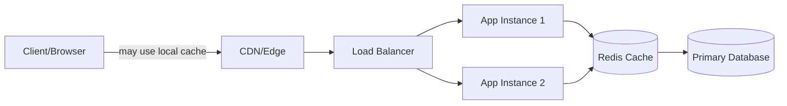
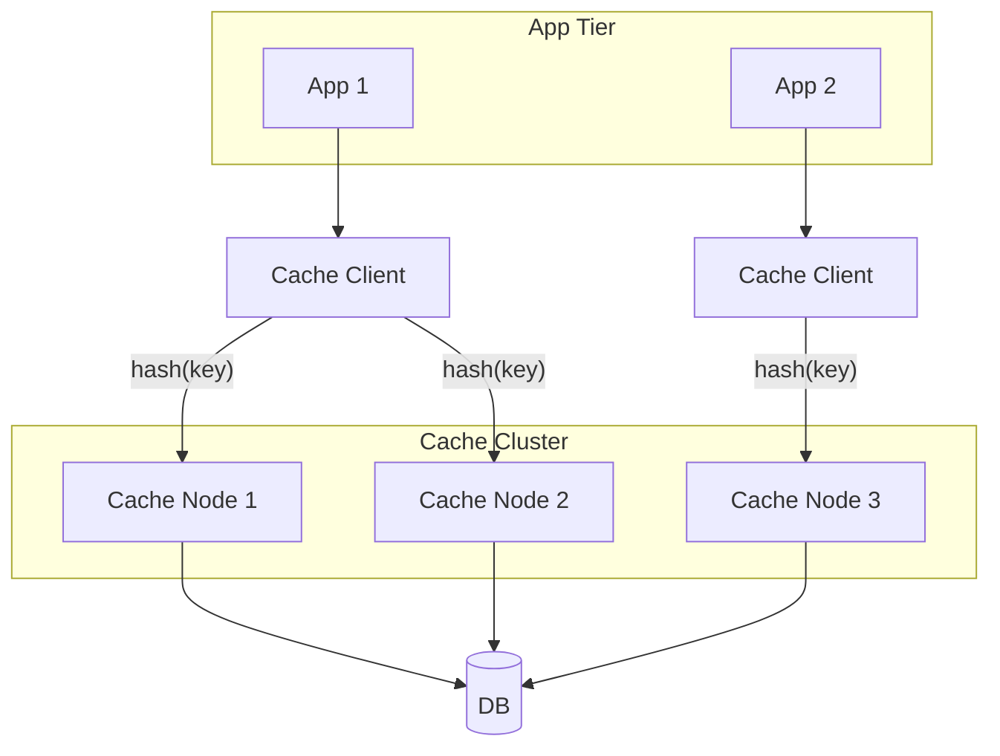
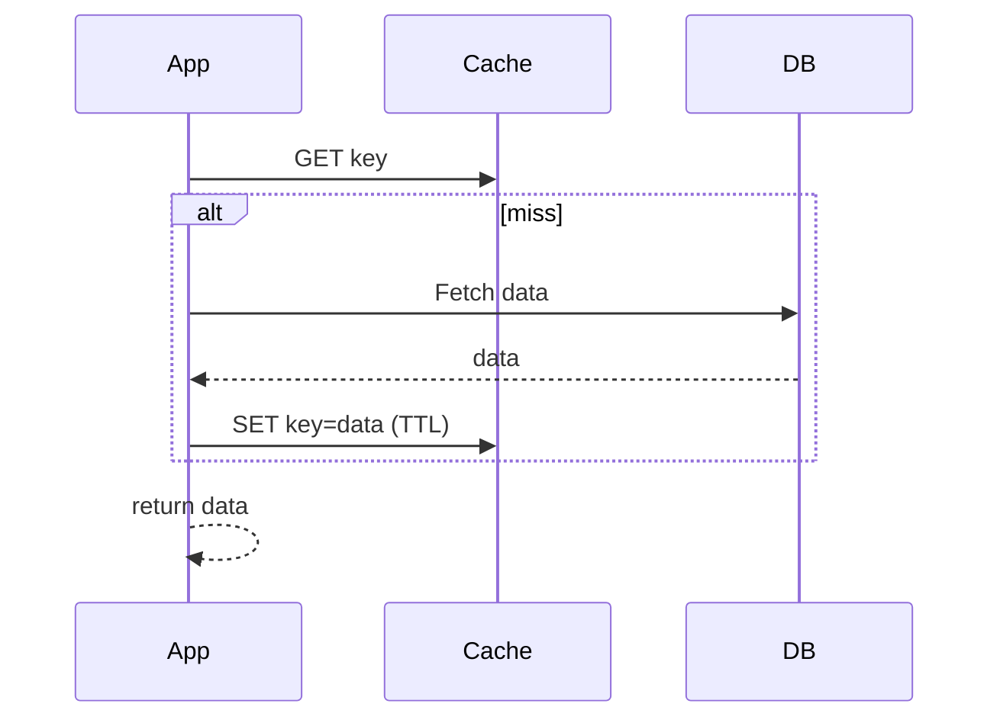
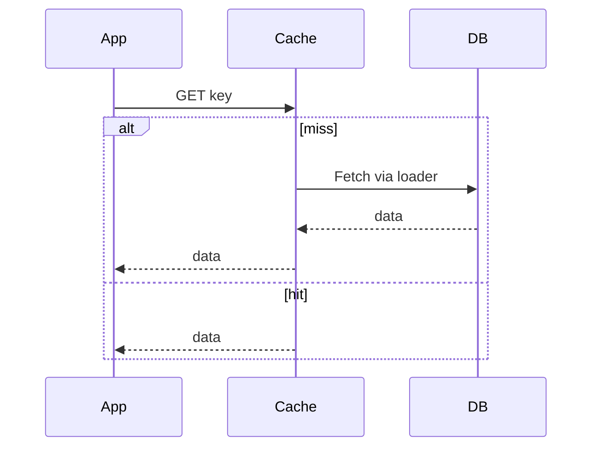
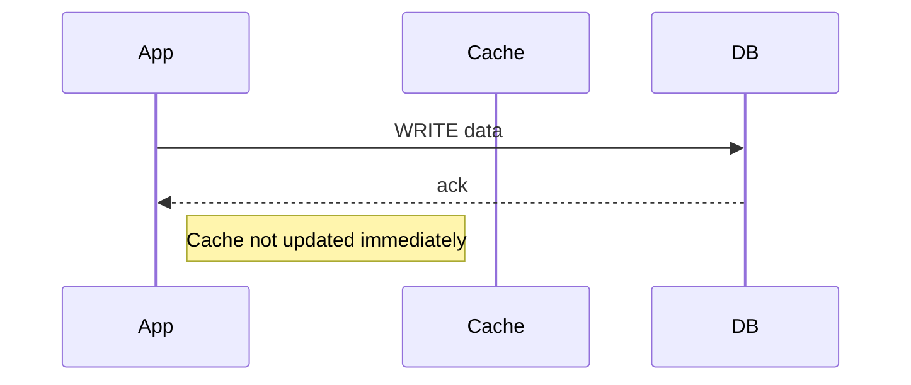
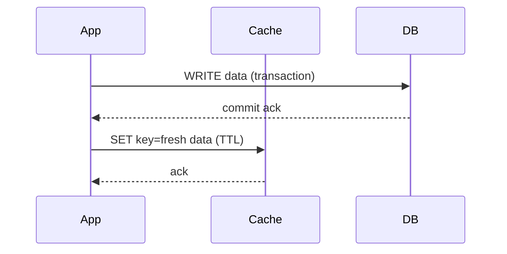
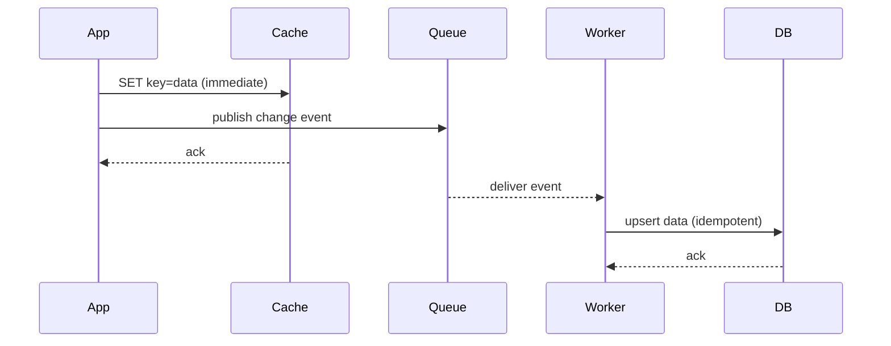

# Caching — Practical Guide

A concise, hands-on introduction to caching and common strategies. For deeper demos, labs can be added later.

Source reference: [Caching strategies video](https://youtu.be/RtOyBwBICRs?si=jIr0xp-lsLl6qSxp)

## 📋 Table of Contents
- What is Caching
- Where Caching Applies (Layers)
- Distributed Caching (and challenges)
- Caching Strategies
  - Cache Aside
  - Read Through
  - Write Around
  - Write Through
  - Write Back
- References

---

## What is Caching
- Keeps recently/frequently accessed data in faster storage (RAM/CDN) to avoid expensive DB/API work.
- Reduces latency and downstream load; improves throughput and cost-efficiency.
- Trades freshness for speed; needs invalidation via TTL, eviction, or versioning.
- Shines for read-heavy, hot-key access patterns and stable results.

---

## Where Caching Applies (Layers)
- Browser cache: per-user asset/data cache via HTTP cache headers.
- CDN/edge cache: offloads static and cacheable dynamic responses near users.
- Load balancer/proxy cache: shared cache at edge/mid-tier (e.g., NGINX/Envoy).
- Application cache (Redis/Memcached): app-managed key/value cache for DB/API results.

Example request flow:

---

## Distributed Caching (and challenges)
Multiple app instances share a cache cluster; a client library maps keys to nodes (often via consistent hashing) to balance and reduce remaps when scaling.

Challenges:
- Rebalancing: scaling cache nodes remaps many keys; consistent/rendezvous hashing limits churn.
- Hot keys: skew overloads a node; consider replication, sharding with replication, or request coalescing.
- Invalidation: multi-writer systems need clear TTL/evict/versioning rules.
- Failover: node loss causes cold misses; use retries, timeouts, and backoff.

---

## Caching Strategies
Pick based on consistency needs, write path cost, and recovery patterns.

### 1) Cache Aside (Lazy Loading)

- How it works: App checks cache; on miss, reads DB and populates cache.
- Pros: Simple; cache only holds used keys; tolerant to cache restarts. Also gives flexibility to alter data in cache without affecting the DB.
- Cons: risk of stale data until TTL/invalidation. not useful for write heavy applications.

### 2) Read Through

- How it works: App always hits cache; cache fetches from DB on miss via loader.
- Pros: Centralized miss handling; uniform app code path; useful for read heavy applications.
- Cons: Not flexible to alter data written in cache, same as DB; Not flexible for write heavy applications.

### 3) Write Around

- How it works: Writes go straight to DB; cache is not updated.
- Pros: Avoids polluting cache with cold data; simple writes.
- Cons: Reads right after write may be stale until TTL/evict. Not useful for write heavy applications.

### 4) Write Through (App-driven)

- How it works: App commits to the DB first, then updates/invalidates the cache before returning.
- Pros: DB is the source of truth; cache stays fresh for written keys; avoids “ACKed but not persisted”.
- Cons: Two hops on the write path; need to handle cache update failures (e.g., retry or fall back to invalidate).

### 5) Write Back (App + durable queue)

- How it works: App updates the cache and publishes a durable event; a worker asynchronously writes to the DB.
- Pros: Very fast perceived writes; batching/throughput via the worker; resilient if Queue is durable; Cache hit increases.
- Cons: Eventual consistency; needs idempotent writes, ordering per key, retries, and reconciliation; Risk of data loss if data not persisted in DB in async way, and cache removes the data before that (can be handled by increasing TTL of data in cache).

---

## References
- Video: [Caching strategies](https://youtu.be/RtOyBwBICRs?si=jIr0xp-lsLl6qSxp)
- Redis, Memcached docs; HTTP caching (RFC 9111); CDN vendor guides
