# Distributed Messaging Queue Systems

## Table of Contents
- [Introduction to Message Queues](#introduction-to-message-queues)
- [Use Cases](#use-cases)
  - [Asynchronous Processing](#asynchronous-processing)
  - [Pace Matching](#pace-matching)
- [Messaging Models](#messaging-models)
  - [Point-to-Point](#point-to-point)
  - [Publish/Subscribe](#publishsubscribe)
- [Apache Kafka Deep Dive](#apache-kafka-deep-dive)
  - [Core Components](#core-components)
  - [Architecture](#architecture)
  - [Message Flow](#message-flow)
  - [Trade-offs and Failure Scenarios](#trade-offs-and-failure-scenarios)
  - [Broker and Cluster Management](#broker-and-cluster-management)
- [RabbitMQ Architecture](#rabbitmq-architecture)
  - [Components](#components)
  - [Exchange Types](#exchange-types)
  - [Message Handling](#message-handling)
- [References](#references)

## Introduction to Message Queues

A message queue is a form of asynchronous service-to-service communication used in distributed systems. Messages are stored in a queue until they are processed and deleted.

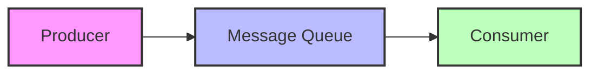

Key benefits:
- Decoupling of services
- Improved scalability
- Better fault tolerance
- Asynchronous communication

## Use Cases

### Asynchronous Processing

Example: User Registration Email Flow

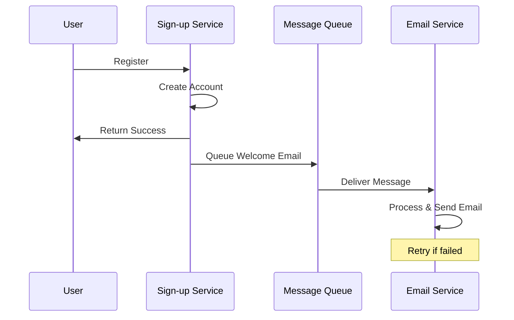

This approach ensures:
- Immediate user feedback
- Reliable email delivery
- Retry capability for failed attempts
- System resilience

### Pace Matching

Helps handle different processing speeds between producers and consumers:

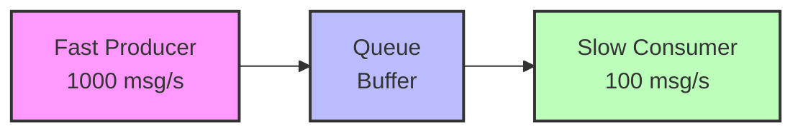

Benefits:
- Prevents consumer overwhelm
- Handles traffic spikes
- Ensures data processing reliability
- No data loss during high load

## Messaging Models

### Point-to-Point
- One message, one consumer
- Message deleted after consumption
- Example: Task processing systems

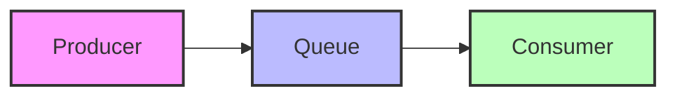

### Publish/Subscribe
- One message, multiple consumers
- Message retained for all subscribers
- Example: Event notification systems

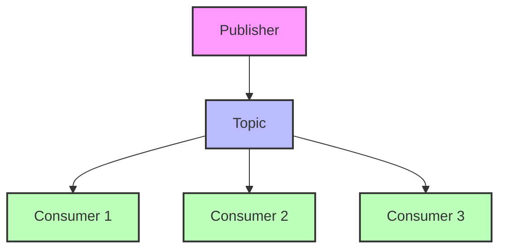

## Apache Kafka Deep Dive

### Core Components

1. **Producer**: Publishes messages to topics
2. **Consumer**: Reads messages from topics
3. **Consumer Group**: Group of consumers sharing workload
4. **Topic**: Category/feed name for messages
5. **Partition**: Subdivision of topics for parallelism
6. **Offset**: Message position in partition
7. **Broker**: Kafka server instance
8. **Cluster**: Group of brokers
9. **ZooKeeper**: Manages cluster state

### Architecture

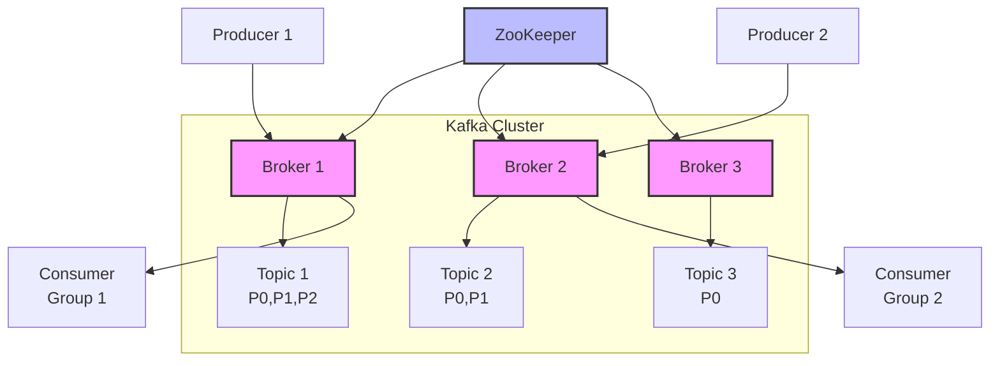

Key Points:
- Topics split into partitions
- Each partition has one leader broker
- Partitions replicated across brokers
- ZooKeeper manages broker leadership

### Message Flow

1. **Partition Selection**:
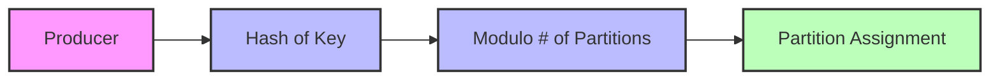

2. **Consumer Group Partitioning**:
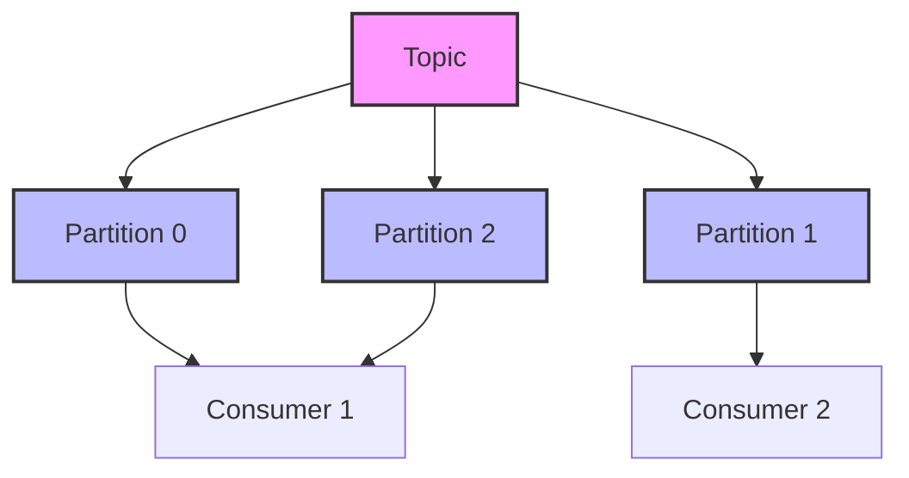

### Trade-offs and Failure Scenarios

1. **Consumer Failure**:
   - Partition reassigned to other consumers in group
   - Processing resumes from last committed offset

2. **Consumer Group Failure**:
   - Messages accumulate in topics
   - No data loss due to retention period
   - Processing resumes when group recovers

3. **Dead Letter Queue**:
   - Handles unprocessable messages
   - Separate topic for failed messages
   - Manual intervention possible

### Broker and Cluster Management

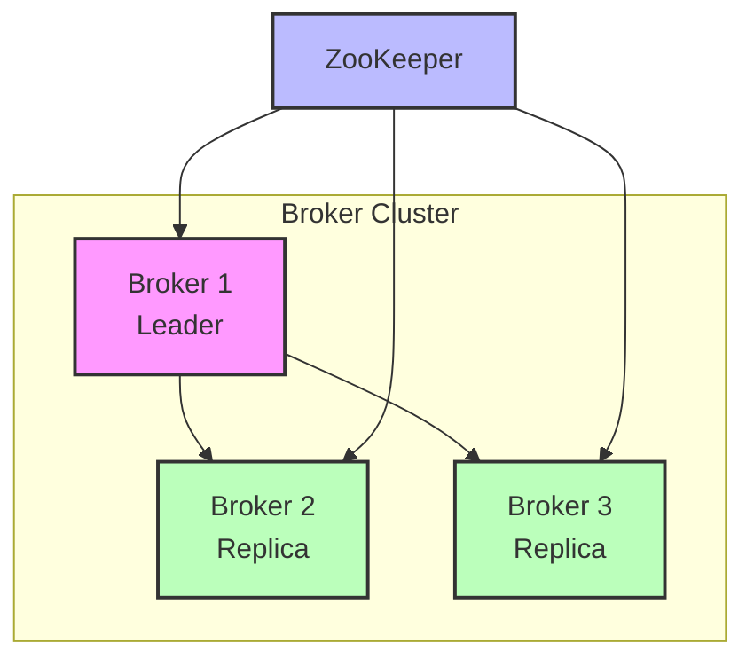

- Leader handles reads/writes
- Replicas maintain synchronized copies
- Automatic leader election on failure

## RabbitMQ Architecture

### Components

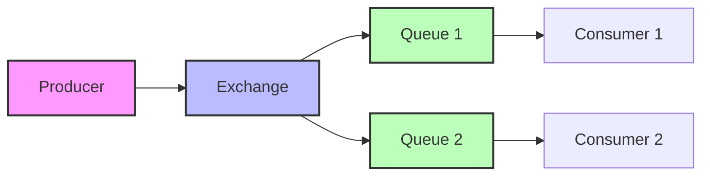

### Exchange Types

1. **Fanout Exchange**:
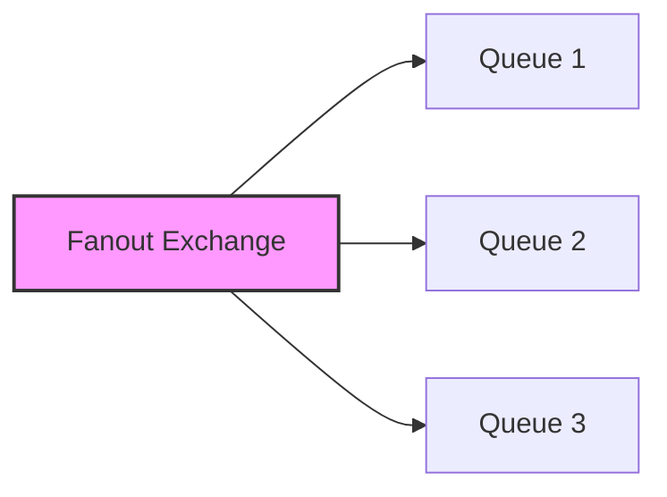

2. **Direct Exchange**:
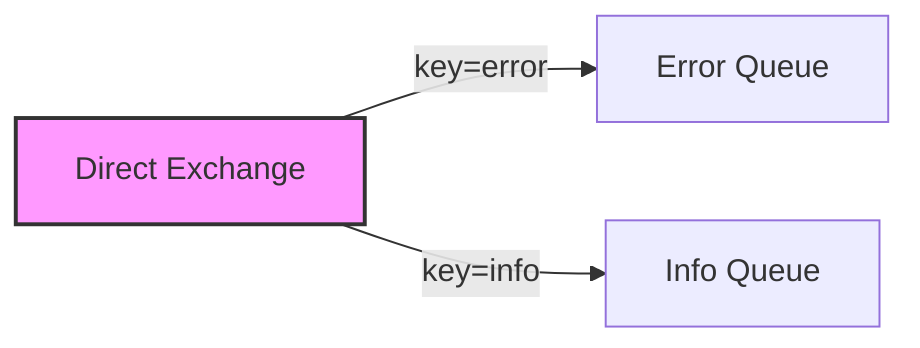

3. **Topic Exchange**:
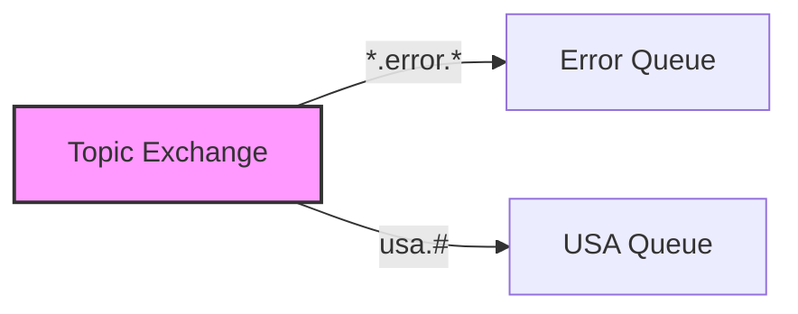

### Message Handling
- Push-based message delivery
- Automatic retry on failure
- No built-in offset concept
- Message acknowledgment required

## References

1. [Apache Kafka Documentation](https://kafka.apache.org/documentation/)
2. [RabbitMQ Documentation](https://www.rabbitmq.com/documentation.html)
3. [Martin Fowler - Enterprise Integration Patterns](https://www.enterpriseintegrationpatterns.com/)
4. [Kafka: The Definitive Guide](https://www.confluent.io/resources/kafka-the-definitive-guide/)
5. [RabbitMQ in Depth](https://www.manning.com/books/rabbitmq-in-depth)
