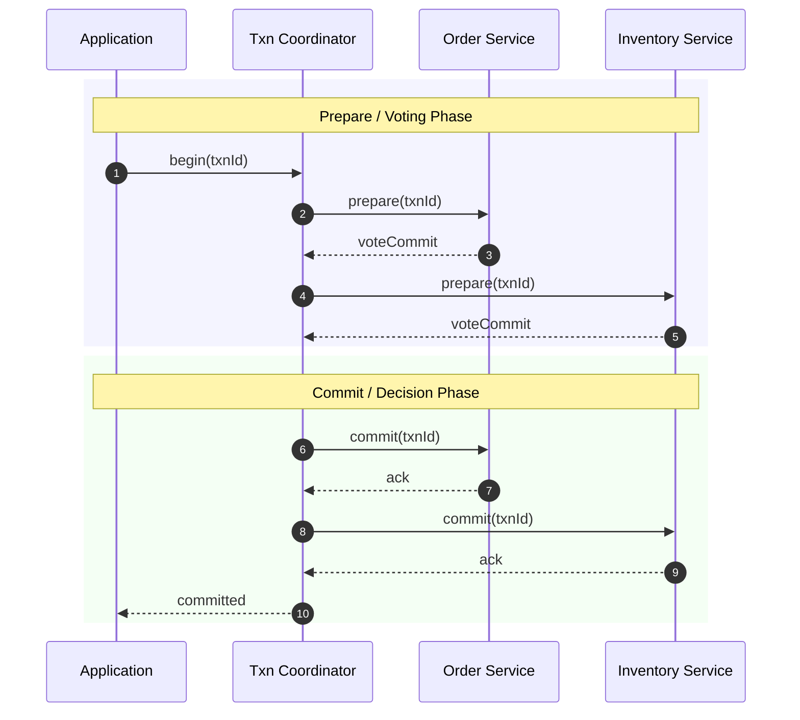
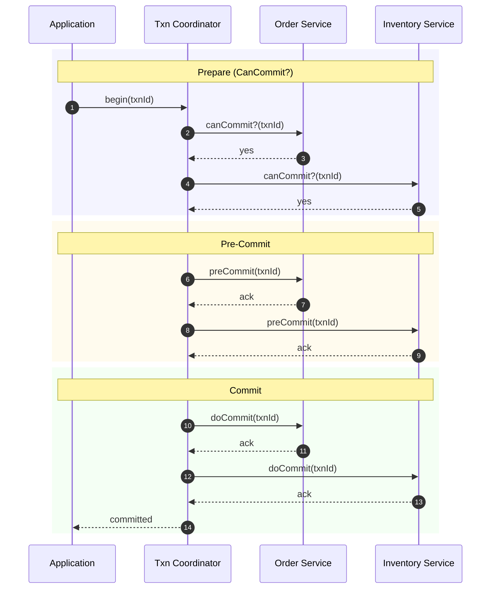
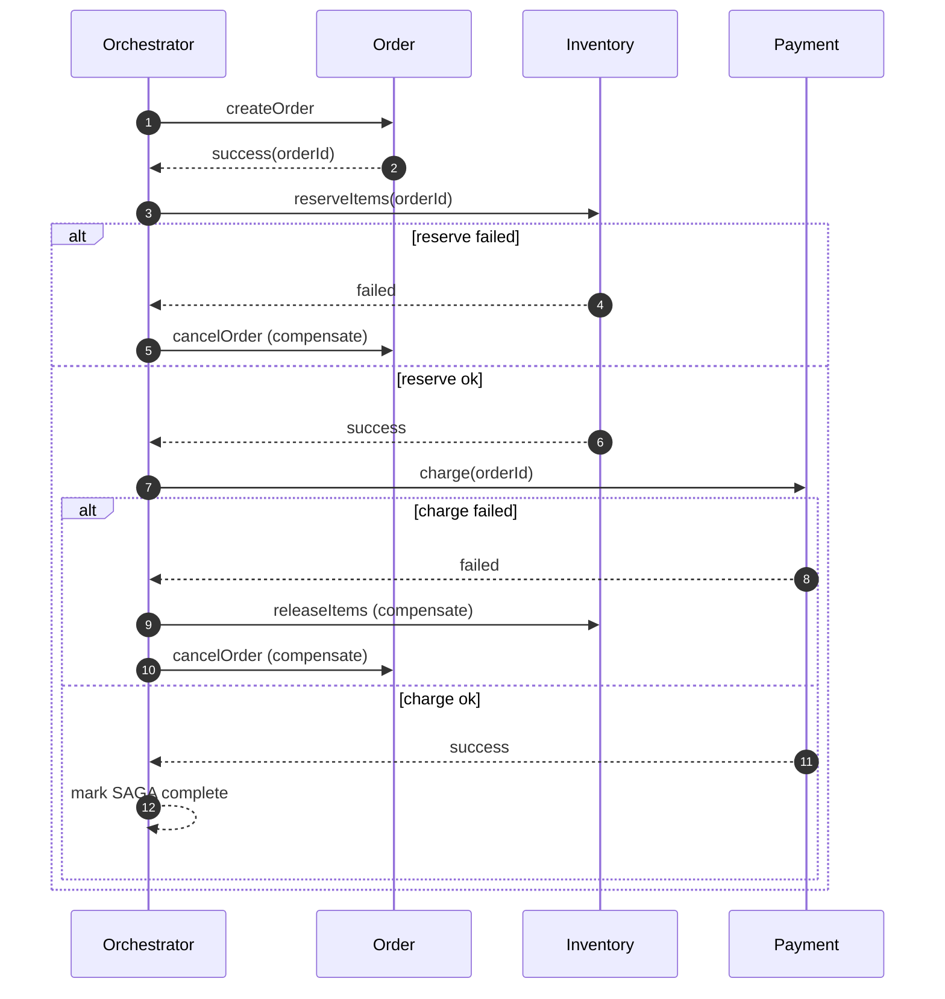

# Distributed Transaction Handling — Practical Guide

## 📋 Table of Contents
- What is a Transaction
- Why Distributed Transactions are Hard
- Approaches
  - Two-Phase Commit (2PC)
  - Three-Phase Commit (3PC)
  - SAGA Pattern (Async)
- Decision Guide
- References

---

## What is a Transaction
- A transaction is a unit of work composed of one or more operations that must either all succeed or all be rolled back.
- Example: Transfer money from Account A to Account B
  - Debit A by X
  - Credit B by X
  - If any step fails, both operations are undone

ACID properties:
- Atomicity: all-or-nothing
- Consistency: transitions system from one valid state to another
- Isolation: concurrent transactions do not interfere
- Durability: once committed, the result survives failures

---

## Why Distributed Transactions are Hard
- Cross-service/database boundaries: no single transactional resource manager
- Partial failures and unreliable networks (timeouts, partitions)
- Coordinated locking can reduce availability and throughput
- Idempotency, retries, and ordering become mandatory concerns

---

## Approaches

### Two-Phase Commit (2PC)
Blocking, coordinator-driven commit protocol across participants/resources.

Participants
- Application (client)
- Transaction Coordinator (TC)
- Participant 1 (Order Service)
- Participant 2 (Inventory Service)

Sequence (happy path)

Failure handling (typical):
- If any participant votes abort, TC sends global abort.
- If TC crashes after prepare but before decision, participants block waiting for decision (requires locks and logs).

Pros
- ACID across heterogeneous resources (with XA/resource managers)

Cons
- Blocking: participants may wait on coordinator decision
- Single point of failure at coordinator; requires careful recovery logs
- Long-held locks hurt availability/throughput in high-latency networks

---

### Three-Phase Commit (3PC)
Non-blocking variant that adds a pre-commit phase and timeouts to reduce blocking.

Phases
1) Prepare (canCommit?)
2) Pre-Commit (ready/ack; participants persist intent)
3) Commit (doCommit)

Participants: same as 2PC

Sequence (happy path)

Operational notes
- Each phase is logged durably by all parties to enable recovery.
- Timeouts allow participants to make progress (e.g., abort) if TC is unreachable.

Pros
- Reduces blocking compared to 2PC; clearer recovery via pre-commit

Cons
- More complexity and messages than 2PC
- Under certain partitions, different participants may make divergent decisions (risk of inconsistency)

---

### SAGA Pattern (Asynchronous, long-lived)
Sequence of local transactions where each step publishes an event; failures are handled via compensating actions.

Flavours
- Orchestration: a central orchestrator commands each step and compensations
- Choreography: services react to events and coordinate via messaging

Key ideas
- Each local step commits to its own DB (no distributed lock)
- Compensating transactions undo prior steps on failure
- Requires idempotency, retry policies, and message deduplication

Optional further reading: see `BasicConcepts/Microservices_DesignPatterns` (SAGA section).

Example (orchestrated, simplified)

Pros
- High availability; avoids distributed locks
- Scales with asynchronous messaging; fits long-running business flows

Cons
- Eventual consistency; compensation complexity
- Requires robust ops (DLQs, retries, tracing)

---

## Decision Guide
- Strong consistency across a small set of reliable resources, short-lived operations: consider 2PC
- Need to reduce blocking while coordinating multiple parties and can tolerate added complexity: 3PC
- Long-running, cross-service workflows where availability is key and eventual consistency is acceptable: SAGA

---

## References
- Gray & Reuter, Transaction Processing: Concepts and Techniques
- Martin Fowler: Sagas, 2PC, Outbox/Inbox patterns
- Pat Helland: Life Beyond Distributed Transactions
- Research on Three-Phase Commit protocols and failure handling

