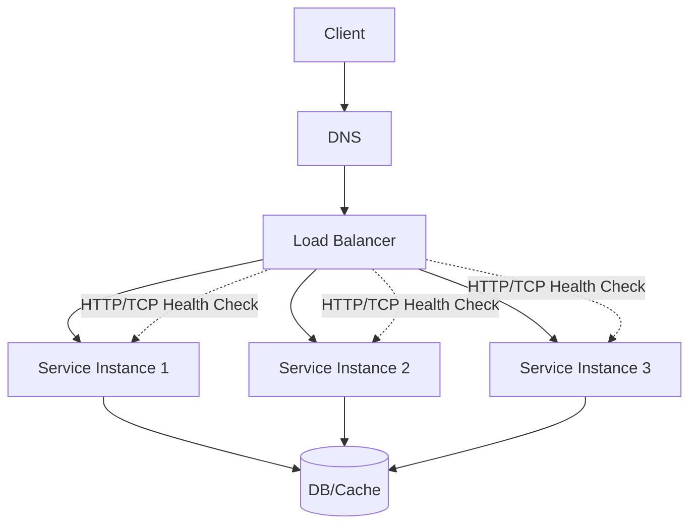
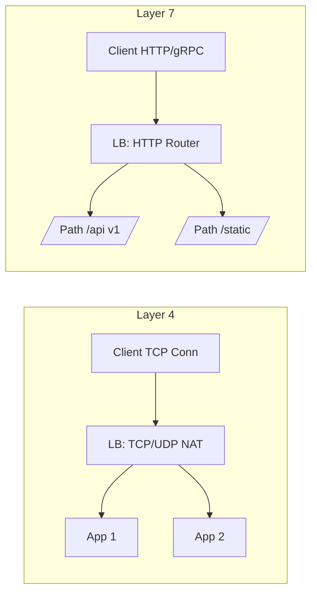
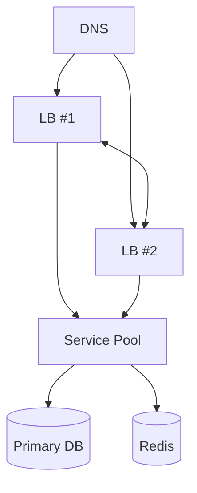
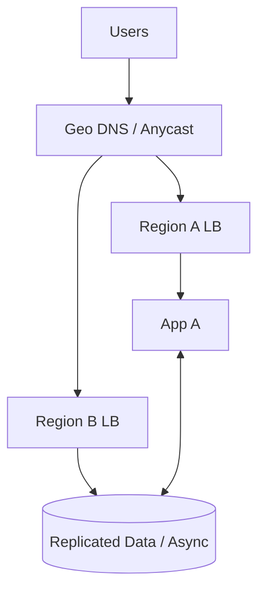

# Load Balancers 🚦 — Complete Learning Hub

A practical, implementation-minded guide to load balancers: what they do, where they fit, how to choose algorithms, deploy for high availability, and measure success.

## 📋 Table of Contents

- [Overview](#overview)
- [Where Load Balancers Sit (L4 vs L7)](#where-load-balancers-sit-l4-vs-l7)
  - [Network Load Balancer (L4)](#network-load-balancer-l4)
  - [Application Load Balancer (L7)](#application-load-balancer-l7)
  - [When to use which](#when-to-use-which)
- [Core Balancing Algorithms](#core-balancing-algorithms)
- [Session Persistence (Sticky Sessions)](#session-persistence-sticky-sessions)
- [Health Checks and Outlier Detection](#health-checks-and-outlier-detection)
- [TLS Termination, Re-encryption, and mTLS](#tls-termination-re-encryption-and-mtls)
- [Edge Features: WAF, Rate Limiting, Caching](#edge-features-waf-rate-limiting-caching)
- [Reference Architectures](#reference-architectures)
- [Capacity Planning and Sizing](#capacity-planning-and-sizing)
- [Failure Modes and Mitigations](#failure-modes-and-mitigations)
- [Observability: Metrics, Logs, Traces](#observability-metrics-logs-traces)
- [Glossary](#glossary)
- [References](#references)

---

## Overview
Load balancers distribute incoming traffic across multiple upstream instances to improve availability, scalability, and latency. They also provide a consistent public entry point, enabling rolling updates and graceful failover.



Key roles:
- Distribute traffic using algorithms (round-robin, least-connections, etc.)
- Detect and remove unhealthy instances
- Optionally terminate TLS and apply edge policies (WAF, rate limits)

---

## Where Load Balancers Sit (L4 vs L7)
- L4 (Transport): Operates on TCP/UDP. Faster, simpler, protocol-agnostic. No request awareness.
- L7 (Application): Understands HTTP/HTTP2/gRPC. Can route by path/host/header, apply caching, compression, WAF.



Rule of thumb: Start with L7 for web APIs; use L4 for raw TCP/UDP or when ultra-low overhead is critical.

---

### Network Load Balancer (L4)
- Operates at transport layer (TCP/UDP)
- Forwards connections without inspecting requests (no path/host/header awareness)
- Ultra-low latency, very high throughput; handles massive concurrent connections
- Ideal for non-HTTP protocols (databases, message brokers, game servers)
- Simple health checks (TCP connect/port); no cookie stickiness or content routing
- Examples: AWS NLB, HAProxy/NGINX TCP mode, Envoy L4

### Application Load Balancer (L7)
- Operates at application layer (HTTP/HTTPS, HTTP/2, gRPC, WebSockets)
- Content-aware: route by host/path/headers; URL rewrite/redirect; canary/blue‑green by rules
- Supports sticky sessions (cookies), WAF integration, header manipulation, auth offload
- Can terminate TLS (and optionally re‑encrypt to upstreams)
- Slightly higher overhead than L4 due to parsing/inspection
- Examples: AWS ALB, NGINX/Envoy/HAProxy HTTP mode

### When to use which
- Use L4 for raw TCP/UDP services, minimal overhead, or non‑HTTP workloads
- Use L7 for web/mobile APIs and microservices needing smart routing, stickiness, auth/WAF, richer policies
- Combine both in layered designs: L7 at the edge, L4 internally for service‑to‑service traffic

## Core Balancing Algorithms
- Round Robin: Simple rotation; good baseline.
- Weighted Round Robin: Allocate more traffic to stronger instances.
- Least Connections: Send to the instance with fewest active connections.
- Weighted Least Connections: Send to the instance with fewest active connections, but with a weight.
- Least Response Time: Prefer the fastest responders (needs metrics).
- IP/URL Hash: Keep the same client or key mapped to the same instance for cache locality.
- Random with Two Choices: Pick two at random, choose the less loaded.

```mermaid
flowchart TD
  A[New Request] --> B{Need Affinity?}
  B -- Yes --> H[Hash(Key)->Target]
  B -- No --> C{Have Latency/Conn Metrics?}
  C -- Yes --> D[Least-Conn / Least-RT]
  C -- No --> E[Round Robin]
  D --> Z[Forward]
  E --> Z
  H --> Z
```

---

## Session Persistence (Sticky Sessions)
- Cookie-based: LB injects a cookie mapping to an upstream.
- Source IP hash: Keep same client on same instance (beware NAT).
- App-level session stores: Prefer stateless services; move session to Redis/DB for resilience.

Use stickiness sparingly—prefer stateless apps for elasticity.

---

## Health Checks and Outlier Detection
- Active checks: Periodic TCP connect or HTTP GET/HEAD.
- Passive checks: Eject instances after error/timeout thresholds.
- Outlier detection: Temporarily quarantine slow/error-prone instances.

Best practice: Use a lightweight `/healthz` endpoint with dependency checks gated behind feature flags.

---

## TLS Termination, Re-encryption, and mTLS
- Edge termination: LB handles certs; traffic to app may be plaintext (intra-VPC) or re-encrypted.
- Re-encryption: LB terminates and re-establishes TLS to upstreams.
- mTLS: Mutual auth between LB and upstreams for zero-trust networks.

Automate certificate renewals (ACME) and enforce modern ciphers.

---

## Edge Features: WAF, Rate Limiting, Caching
- WAF: OWASP rules, bot protection, IP reputation
- Rate limiting: Token/leaky bucket by user/API key/IP
- Caching: Static assets and cacheable API responses at the edge

---

## Reference Architectures

### Single Region — Highly Available

- Two LBs in active-active with health-checked DNS
- Instances across at least two AZs

### Multi-Region — Global Traffic

- Geo-DNS or Anycast directs to nearest healthy region
- Asynchronous data replication; failover runbooks

### Blue/Green and Canary
- Blue/Green: Two identical stacks; switch traffic at LB/DNS.
- Canary: Route small % to new version; auto-rollback on SLO breach.

---

## Capacity Planning and Sizing
- Estimate QPS: peak vs p95 sustained; add headroom (≥30–50%).
- Concurrency: max connections per LB node; tune keep-alive.
- TLS cost: enable HTTP/2, session resumption, and ECDSA certs.
- Benchmarks: wrk, k6, locust; validate latency percentiles (p50/p95/p99).

Quick BoE: required_nodes ≈ (peak_qps × avg_cost_ms/1000) ÷ per_node_capacity × safety_factor.

---

## Failure Modes and Mitigations
- Hotspotting: Prefer randomized or least-conn algorithms.
- Slowloris/connection exhaustion: Configure timeouts, headers buffering.
- Thundering herd on failover: Use jittered retries, circuit breakers.
- Misconfigured health checks: Separate readiness vs liveness.

---

## Observability: Metrics, Logs, Traces
- Metrics: requests/s, concurrency, error rate, upstream_ejects, retry rate, TLS handshakes, saturation.
- Logs: request logs with upstream, status, latency buckets.
- Tracing: propagate headers (W3C traceparent, B3) through LB.

---

## Glossary
- Anycast: Same IP advertised from multiple locations; routing picks closest.
- GSLB: Global server load balancing across regions.
- Sticky session: Keeping a client bound to an upstream instance.

---

## References
- AWS ALB/NLB, GCP External/Internal LB, Azure Front Door/Application Gateway
- Envoy, NGINX, HAProxy official docs
- OWASP ModSecurity Core Rule Set

> This guide will be refined against your uploaded notes once OCR/text extraction is finalized. If you prefer, share a text export to align terms and examples page-by-page.
