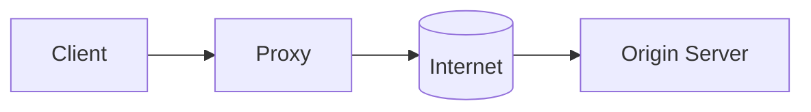
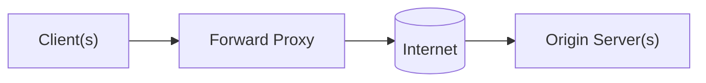
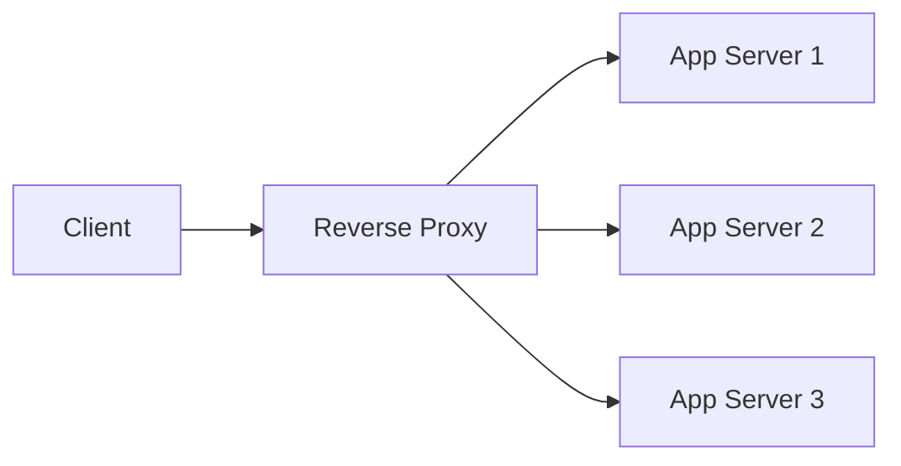

## Proxy Servers and Reverse Proxies

A practical guide to proxies, reverse proxies, their types, and how they compare to VPNs, load balancers, and firewalls. Inspired by concepts discussed in this video: [Proxy vs Reverse Proxy (YouTube)](https://youtu.be/yeaPUFaXgdA?si=6foD6JZOwZDOZBuw).

### Table of Contents
- [What is a Proxy Server?](#what-is-a-proxy-server)
- [Types of Proxies](#types-of-proxies)
  - [Forward Proxy](#forward-proxy)
  - [Reverse Proxy](#reverse-proxy)
- [Proxy vs VPN](#proxy-vs-vpn)
- [Proxy vs Load Balancer](#proxy-vs-load-balancer)
- [Proxy vs Firewall](#proxy-vs-firewall)
- [Further Reading](#further-reading)

### What is a Proxy Server?

- **Definition**: An intermediary server that sits between a client and the destination server. It receives client requests, may modify or route them, forwards them to the destination, receives the response, and returns it to the client.
- **Why use it?**
  - **Privacy/anonymity**: Hide client IP addresses
  - **Access control**: Enforce policies, authentication
  - **Caching**: Reduce latency and bandwidth by serving cached content
  - **Security**: Inspect/filter traffic, rate-limit, block malicious requests
  - **Operational flexibility**: Centralize TLS termination, header rewrites, path-based routing

#### High-Level Flow

### Types of Proxies

#### Forward Proxy

- **What it is**: A proxy that represents the client. The destination server typically sees the proxy as the requester instead of the real client.
- **Where it sits**: On the client-side network boundary; clients are configured to send requests to it.
- **Typical uses**: Client anonymity, content filtering, egress control, caching web content.

Diagram:

- **How it works**
  - Client sends request to forward proxy
  - Proxy forwards to destination, possibly altering headers, applying ACLs, or serving from cache
  - Response is sent back to the client via proxy

- **Examples**: Squid, Privoxy, corporate HTTP proxy, browser-configured proxies

- **Pros**
  - Client IP masking and privacy
  - Centralized policy and content filtering
  - Caching can reduce latency and bandwidth

- **Cons**
  - Requires client configuration
  - Can become a bottleneck if not scaled
  - Limited end-to-end visibility from the origin’s perspective

#### Reverse Proxy

- **What it is**: A proxy that represents the server or server farm. Clients connect to the reverse proxy; it routes to backend servers.
- **Where it sits**: In front of application servers (server-side boundary).
- **Typical uses**: TLS termination, load-aware routing, caching, compression, request normalization, WAF integration.

Diagram:

- **How it works**
  - Client connects to the reverse proxy endpoint (e.g., api.example.com)
  - Reverse proxy selects a backend (path/host/headers/weights), may cache or compress
  - Returns response to the client while shielding backend details

- **Examples**: NGINX, HAProxy (as reverse proxy), Envoy, Apache HTTP Server (mod_proxy)

- **Pros**
  - Shields backend servers and centralizes security controls
  - Enables blue/green, canary routing, path/host-based routing
  - Can offload TLS and provide caching/compression

- **Cons**
  - A point of failure without redundancy
  - Needs careful configuration to avoid header/IP loss (e.g., X-Forwarded-For)
  - Additional hop may add small latency

### Proxy vs VPN

| Aspect | Proxy | VPN |
|---|---|---|
| Primary purpose | App/HTTP(S) request mediation | Encrypt all traffic at network layer |
| Scope | Per-app/per-protocol (e.g., HTTP) | System-wide tunnel (all apps) |
| Encryption | Optional (depends on protocol) | Strong encryption (e.g., IPSec/WireGuard/OpenVPN) |
| Identity masking | Masks client IP to origin | Masks client IP to all destinations |
| Client setup | Often app/browser config | OS-level VPN client |
| Use cases | Caching, ACLs, routing, request transforms | Secure remote access, privacy, geo-routing |

Key takeaway: A VPN provides encrypted network tunnels for all traffic; a proxy intermediates specific application traffic and can transform/cache/route it.

### Proxy vs Load Balancer

| Aspect | Proxy (Reverse) | Load Balancer |
|---|---|---|
| Primary role | Intermediary that can modify/inspect requests | Distribute traffic across backends |
| Focus | Security, routing, transformations, caching | Efficient, healthy distribution |
| Algorithms | Path/host/header rules, cache logic | Round-robin, least-connections, hashing |
| TLS termination | Common | Common |
| Examples | NGINX, Envoy, Apache | HAProxy, NLB/ALB, F5 |

Note: Many modern products serve as both reverse proxy and load balancer. The distinction is conceptual—load balancing is a function; a reverse proxy often includes it and more.

### Proxy vs Firewall

| Aspect | Proxy | Firewall |
|---|---|---|
| OSI layer | Usually L7 (application) | Often L3/L4 (packet/connection), can be L7 (NGFW) |
| Purpose | Mediate and transform requests/responses | Permit/deny traffic based on rules |
| Visibility | Application semantics (URLs, headers) | IPs, ports, protocols (NGFW can inspect deeper) |
| Typical placement | Between client and server apps | Network perimeter/segments |
| Examples | NGINX, Squid, Envoy | iptables, pf, Palo Alto, AWS Security Groups |

Key takeaway: Firewalls primarily control reachability; proxies mediate and often transform application-level traffic.

### Further Reading

- [Proxy vs Reverse Proxy (YouTube)](https://youtu.be/yeaPUFaXgdA?si=6foD6JZOwZDOZBuw)
- NGINX, HAProxy, and Envoy documentation for production patterns

