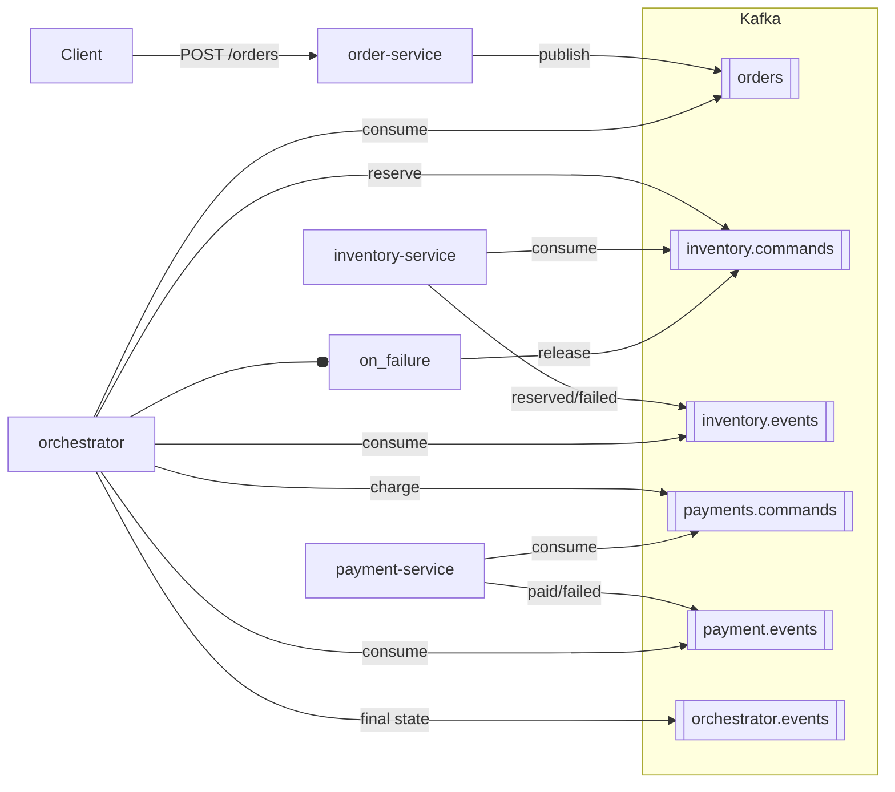

## DistributedTxLab — Orchestrated Saga over Kafka

Hands-on lab to learn the Saga pattern for distributed transactions using Kafka and FastAPI microservices. You will place an order, then watch the orchestrator coordinate inventory reservation and payment. On failures, the orchestrator triggers compensation (inventory release) to keep the system consistent.

---

### What you’ll build
- **order-service (8001)**: Accepts orders and publishes `orders` events
- **orchestrator (8002)**: Listens to `orders`/`inventory.events`/`payment.events`, drives the saga
- **inventory-service (8003)**: Reserves/releases stock via commands, emits events
- **payment-service (8004)**: Charges with a configurable failure rate, emits events

All communication between services happens via Kafka topics. The orchestrator ensures the correct sequence and compensation on failures.

---

### Prerequisites
- Docker Desktop running (Windows: this project uses `host.docker.internal`)
- A Kafka broker reachable at `localhost:9092`
  - Tip: You can use your Kafka stack from `Projects/MessageQueueExperiments` if you have one.
- PowerShell (examples below are PowerShell-friendly)

Kafka connectivity is configured via env `KAFKA_BOOTSTRAP_SERVERS=host.docker.internal:9092` in `docker-compose.yml` so containers can reach your host’s Kafka on Windows.

---

### Quick start
From `Projects/DistributedTxLab/`:

```powershell
docker compose up -d --build
```

Health checks:

```powershell
curl.exe -s http://localhost:8001/health
curl.exe -s http://localhost:8002/health
curl.exe -s http://localhost:8003/health
curl.exe -s http://localhost:8004/health
```

Place an order (published to Kafka topic `orders`):

```powershell
$body = @{ orderId='o-1001'; sku='ABC'; quantity=2; amount=149.99; currency='USD' } | ConvertTo-Json
curl.exe -s -X POST http://localhost:8001/orders -H "Content-Type: application/json" -d $body
```

Watch the saga play out in logs (reserve inventory → charge payment → final state):

```powershell
docker compose logs -f orchestrator inventory-service payment-service
```

---

### Services and endpoints
- **order-service (8001)**
  - `POST /orders` → body fields: `orderId`, `sku`, `quantity`, `amount`, `currency`
  - `GET /health`
- **orchestrator (8002)**
  - `GET /health`
- **inventory-service (8003)**
  - `GET /health` (shows in-memory stock)
- **payment-service (8004)**
  - `GET /health` (shows failure rate)

Ports are mapped in `docker-compose.yml`.

---

### Topics and contracts
Configured in `shared/config.py` (defaults shown):

- `orders` (produced by order-service)
- `inventory.commands` (consumed by inventory-service)
- `inventory.events` (produced by inventory-service)
- `payments.commands` (consumed by payment-service)
- `payment.events` (produced by payment-service)
- `orchestrator.events` (produced by orchestrator; final saga state)

Event shapes are documented in `shared/schemas.md`. Example `orders` event:

```json
{"sagaId":"uuid","orderId":"o-123","sku":"ABC","quantity":2,"amount":500,"currency":"USD","traceId":"uuid","ts":"2025-01-01T00:00:00Z"}
```

Partitioning key is the `sagaId` to keep all steps for a saga together.

---

### End-to-end flow (happy path)
1) `order-service` publishes `orders` with a new `sagaId`
2) `orchestrator` receives the order and sends `reserve` on `inventory.commands`
3) `inventory-service` reserves stock and emits `inventory.events` status `reserved`
4) `orchestrator` sends `charge` on `payments.commands`
5) `payment-service` emits `payment.events` status `paid`
6) `orchestrator` emits final `orchestrator.events` with saga `completed`

Failure path: if payment fails, orchestrator issues `release` to inventory; final saga state is `failed` with a reason.

---

### Failure/compensation demo
`payment-service` supports a configurable failure rate via env `PAYMENT_FAILURE_RATE` (default `0.3`). To try more frequent failures:

1) Edit `docker-compose.yml` → under `payment-service.environment` add:

```yaml
- PAYMENT_FAILURE_RATE=0.8
```

2) Recreate services:

```powershell
docker compose up -d --build
```

3) Post a few orders and observe `payment failed` logs and `release` commands sent to inventory.

---

### Troubleshooting
- **503 from `POST /orders`**: Kafka not reachable. Ensure a broker is running at `localhost:9092` and that Docker Desktop networking allows `host.docker.internal`.
- **No reactions from consumers**: Consumers start at `auto_offset_reset=earliest`. If you ran this before and changed topics, you might be at the end of the log. Quick fix: change consumer group names in `shared/config.py` or wipe local Kafka data.
- **Port conflicts**: Adjust the exposed ports in `docker-compose.yml`.
- **Inventory out of stock**: Initial stock is in-memory in `services/inventory-service/app.py` (`sku_stock = {"ABC": 5, "XYZ": 3}`). Restart the stack to reset.

---

### Cleanup
```powershell
docker compose down -v
```

---

### Files to read
- `docker-compose.yml` — services and ports
- `services/order-service/app.py` — publishes orders
- `services/orchestrator/app.py` — saga logic
- `services/inventory-service/app.py` — reserve/release
- `services/payment-service/app.py` — charge + failure simulation
- `shared/config.py` — topics, groups, helpers
- `shared/schemas.md` — event contracts

---

### Architecture diagram



