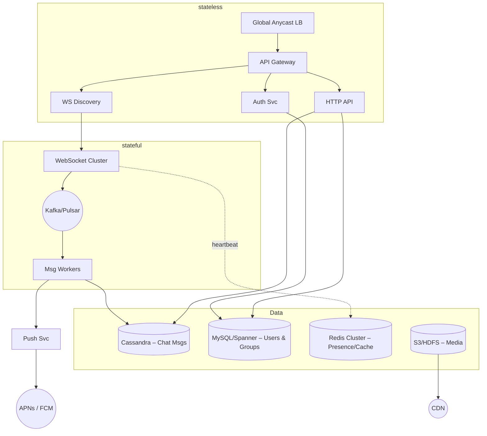
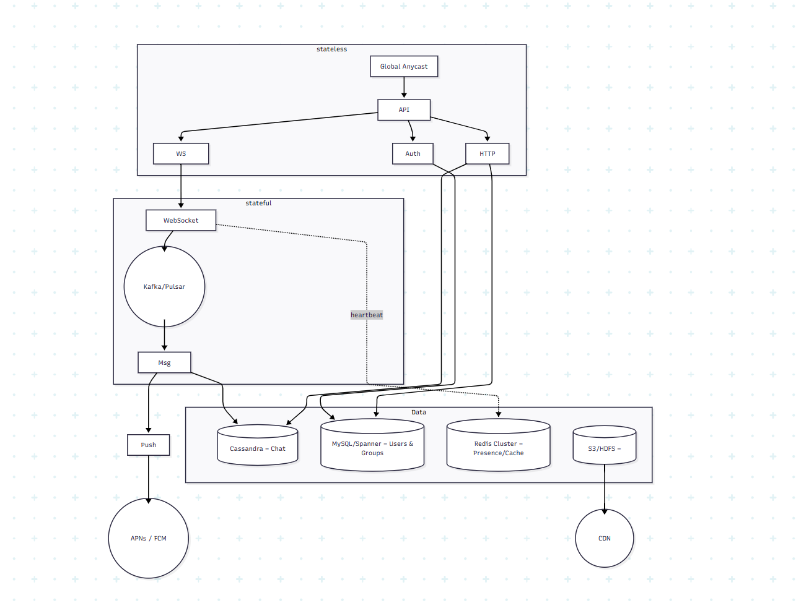
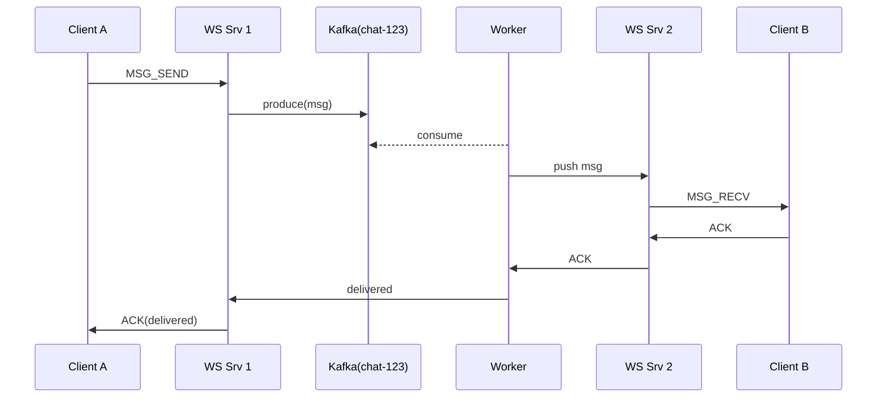
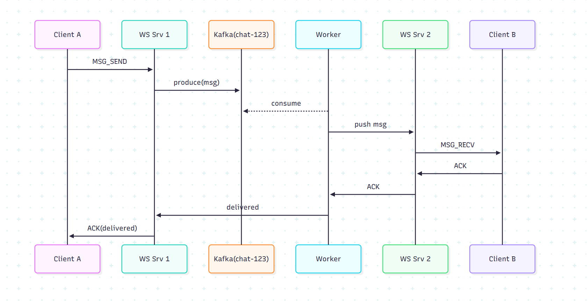
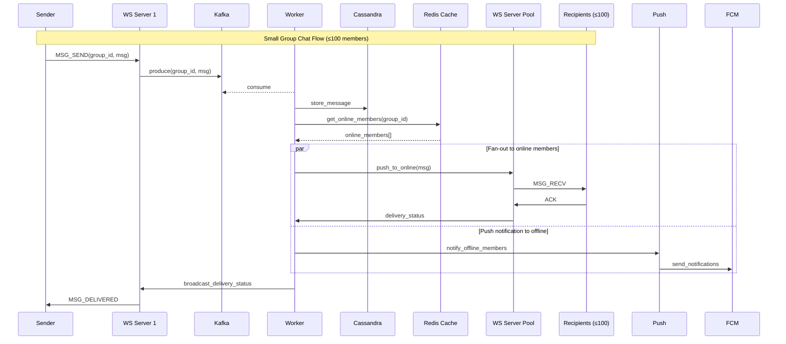
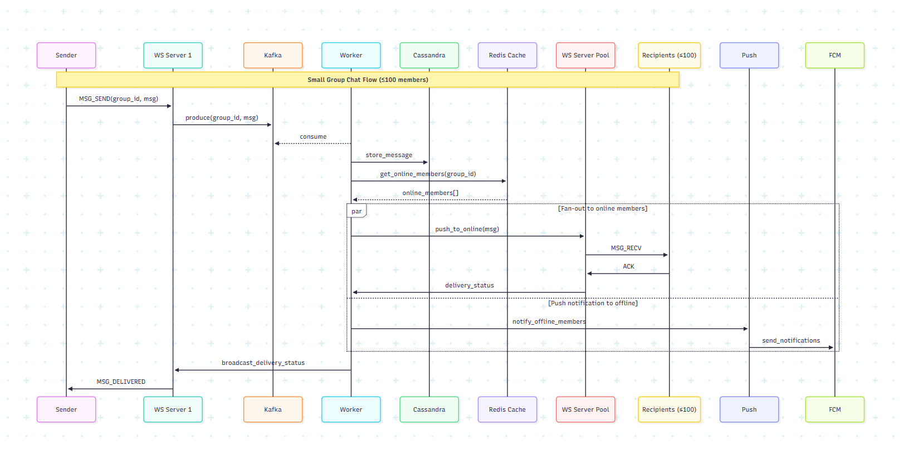
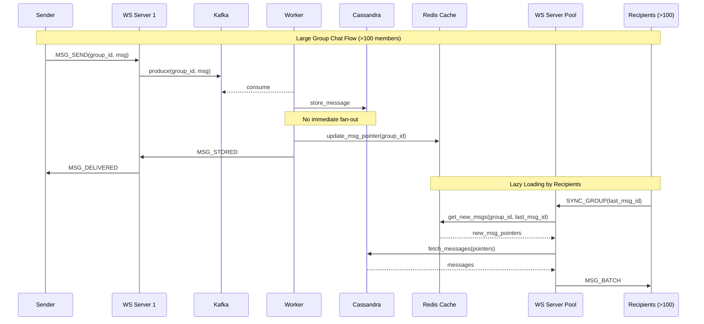
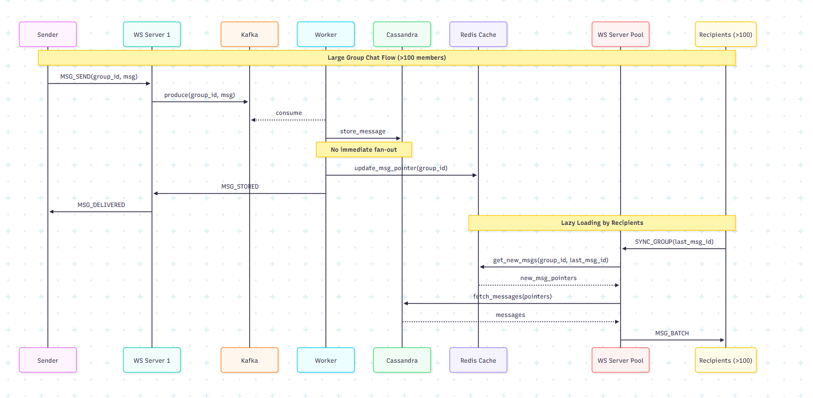
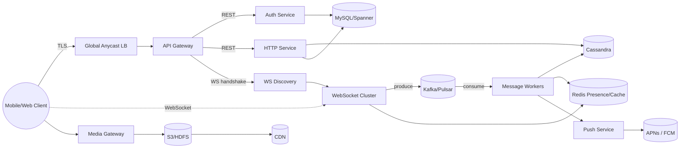
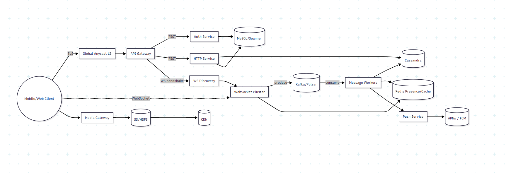

# WhatsApp-Style Chat System – Interview Cheat-Sheet

> Concise, interviewer-friendly blueprint covering requirements, capacity, architecture, data, and trade-offs for a global real-time chat platform (think WhatsApp/Signal).

---
## 1. Requirements
### Functional
1. OTP-based sign-up / login (multi-device).
2. 1-to-1 encrypted text + media messages (≤ 16 MB).
3. Small group chats (≤ 512 members) with admin controls.
4. Message state: **sent → delivered → read**.
5. Presence (online, typing) & push notifications.
6. Search recent chats/messages.

### Non-Functional Requirements & SLOs
| Attribute | Target | Why it matters |
|-----------|--------|----------------|
| End-to-end latency | P99 < 200 ms (msg send→recv); server processing < 50 ms | Feels "instant" to users |
| Availability | 99.99 % monthly for core messaging; 99.999 % for read history | Global chat is mission-critical |
| Durability | ≤ 10⁻⁹ probability of message loss (RF=3, quorum writes) | Never lose a user's message |
| Order / Consistency | Per-chat strict order; cross-device sync ≤ 5 s | Prevent out-of-order confusion |
| Peak throughput | 700 k msgs/s ingress; 2.1 M replica writes/s | Drives partition counts |
| Scalability | 10× traffic growth with ≈ linear cost/latency | Future-proof |
| Security | TLS 1.3 in transit; Signal-protocol E2E; keys in HSM | Privacy & integrity |
| Privacy / Compliance | GDPR "delete-me" honored ≤ 30 days; logs TTL 30 d | Legal/regulatory |
| DR (RTO / RPO) | RPO ≤ 15 min, RTO ≤ 5 min cross-region | Survive region outage |
| Observability | 90 % traces sampled; SLO breach alert ≤ 2 min | Fast incident response |
| Cost efficiency | OpEx < $0.05 per MAU per month; hot/cold tiering | Keep chat affordable |
| Maintainability | Zero-downtime blue-green deploys; online schema changes | Ship features weekly |

---
## 2. Back-of-Envelope
| Metric | Quick Math | Result |
|--------|-----------|--------|
| Storage/day | 60 B msgs × 0.8 KB | **48 TB** |
| Hot S3/year | 48 TB × 365 | ~17 PB (×3 RF ≈ 50 PB) |
| Write peak | 700 k msg/s ×3 replicas | 2.1 M writes/s |
| Concurrent WS | 10 % DAU online | 100 M conns |

> ⚠️  Numbers guide shard counts & partitioning strategy – they don't need to be exact.

### Derivation & assumptions
1. **Messages/day**  
   • 1 B MAU × ~60 msgs/user/day ⇒ **60 B msgs/day**.

2. **Average message size**  
   • Text + headers + encryption overhead ≈ **0.8 KB** (attachments excluded).

3. **Daily storage**  
   • 60 B × 0.8 KB ≈ **48 TB/day** raw.

4. **Annual hot storage**  
   • 48 TB × 365 ≈ **17 PB**; with replication factor (RF)=3 ⇒ **~50 PB** on disk.

5. **Peak write throughput**  
   • 60 B ÷ 86 400 s ≈ **700 k msgs/s**; with RF 3 ⇒ **≈ 2.1 M replica writes/s**.

6. **Concurrent WebSocket conns**  
   • Assume 1⁄3 MAU are DAU (~330 M) and 10 % are online simultaneously ⇒ **~33 M** (rounded up to 100 M for head-room & multi-device).

7. **Sustained bandwidth**  
   • 48 TB/day ÷ 86 400 s ≈ **550 MB/s ingress**; double for egress ⇒ **≈ 1 GB/s aggregate baseline**.


---
## 3. High-Level Architecture


#### Architecture walkthrough

1. **Edge Layer – Stateless**
   * **LB (Global Anycast LB)** – routes client TLS traffic to the nearest healthy region.
   * **API Gateway** – TLS termination, rate-limiting, auth header parsing.
   * Fans out to:
     * **Auth Svc** – OTP login & token refresh.
     * **WS Discovery** – tells a client which WebSocket node to use (sticky sharding).
     * **HTTP API** – CRUD/search endpoints (list chats, fetch history, update profile).

2. **Realtime Layer – Stateful**
   * **WebSocket Cluster** – holds millions of long-lived connections; publishes each incoming message to **Kafka/Pulsar** partitioned by `chat_id`.
   * **Kafka/Pulsar** – durable log providing per-chat ordering and back-pressure.
   * **Message Workers** – consume from Kafka then:
     * persist the message to **Cassandra**,
     * push the event to the recipient's WebSocket server,
     * trigger **Push Svc → APNs/FCM** if the user is offline.

3. **Data Stores**
   * **Cassandra (MsgDB)** – hot chat history with TTL.
   * **MySQL/Spanner (UserDB)** – strong consistency for users & groups.
   * **Redis (Cache)** – presence, recent-chat cache, PUB/SUB.
   * **S3/HDFS (Media)** backed by **CDN** – large blob storage & global delivery.

4. **Flow highlights**
   * Stateless edge enables effortless horizontal scaling.
   * WS → Kafka decouples network I/O from disk persistence.
   * Partition-by-chat retains ordering while distributing load.
   * Media path bypasses chat pipeline, shielding core services from large files.
   * Multi-region replication & quorum writes provide disaster-tolerance.



### Why these picks?
| Concern | Choice | WHY |
|---------|--------|-----|
| Long-lived, low-latency duplex channel | **WebSocket** | Browser/mobile native, avoids polling |
| Buffering & ordering | **Kafka / Pulsar** | Partition by `chat_id` ⇒ ordered, durable & back-pressure |
| Hot message store | **Cassandra/Scylla** | Massive writes, multi-DC, TTL & wide-rows (chat history) |
| Strong user/group consistency | **SQL (MySQL/Spanner)** | ACID for profiles, memberships |
| Cache & presence | **Redis Cluster** | Sub-ms reads, PUB/SUB support |
| Media | **S3 + CDN** | Cheap, geo-replicated, offloads traffic |

---
## 4. Data Model (simplified)
```sql
-- Relational
users(uid BIGINT PK, phone VARCHAR(15) UNIQUE, name VARCHAR(50), avatar VARCHAR(256), created_at TIMESTAMP);

groups(gid BIGINT PK, name VARCHAR(64), owner BIGINT, created_at TIMESTAMP);

group_members(gid BIGINT, uid BIGINT, role ENUM('admin','member'), PRIMARY KEY(gid, uid));

-- Cassandra (hot history)
CREATE TABLE messages (
  chat_id TEXT,
  msg_ts TIMEUUID,          -- ordering, part of PK
  msg_id UUID,
  sender BIGINT,
  type SMALLINT,
  ciphertext BLOB,
  media_url TEXT,
  status TINYINT,
  PRIMARY KEY ((chat_id), msg_ts)
) WITH CLUSTERING ORDER BY (msg_ts DESC);
```

---
## 5. Core Flows
### 5.1  1-to-1 Delivery




*Offline?* Worker triggers Push Svc.

#### Sequence walkthrough

| Step | Who | What / Why |
|------|-----|------------|
| 1 | **Client A → WS Srv 1** | `MSG_SEND` frame with ciphertext + metadata travels over existing WebSocket. |
| 2 | **WS Srv 1 → Kafka** | Server **produces** the event into the `chat_id` partition, ensuring durability & order. |
| 3 | **Worker ← Kafka** | Worker service **consumes** the new event in real-time. |
| 4 | **Worker → WS Srv 2** | Worker locates recipient's WebSocket server and pushes the message. |
| 5 | **WS Srv 2 → Client B** | Recipient gets `MSG_RECV`; UI shows new message almost instantly. |
| 6 | **Client B → WS Srv 2** | Client sends `ACK` after decrypting & displaying. |
| 7 | **ACK chain** | WS Srv 2 → Worker → WS Srv 1 → Client A, updating delivery state. |
| Offline | **No WS for B?** | Worker triggers Push Svc → APNs/FCM so B still gets notified. |

**Design rationale**  
• WS servers remain lightweight—durability lives in Kafka.  
• Kafka guarantees per-chat order and acts as a buffer under load.  
• Worker centralizes fan-out logic and off-loads push notifications.  
• ACK propagation keeps both clients' UIs in sync without polling.

### 5.2  Group Chat Flows

The system handles group chats differently based on the group size to optimize for performance and resource utilization:

#### 5.2.1 Small Group Chat Flow (≤100 members)




**Flow Explanation:**
1. **Message Send**
   - Sender sends message to their WebSocket server
   - Message includes `group_id` and encrypted content

2. **Message Processing**
   - WebSocket server produces message to Kafka topic (partitioned by `group_id`)
   - Worker consumes message and handles fan-out logic

3. **Storage & Member Resolution**
   - Worker stores message in Cassandra (for persistence)
   - Queries Redis cache for online group members
   - Maintains delivery status tracking

4. **Parallel Distribution**
   - For online members:
     - Pushes message to respective WebSocket servers
     - Collects delivery acknowledgments
   - For offline members:
     - Triggers push notifications via FCM/APNs
     - Messages stored for later retrieval

#### 5.2.2 Large Group Chat Flow (>100 members)




**Flow Explanation:**
1. **Message Send**
   - Similar initial flow: Sender → WebSocket → Kafka → Worker
   - Message stored in Cassandra

2. **Pointer Update**
   - Instead of fan-out, updates message pointer in Redis
   - Maintains last message ID for the group
   - Quick acknowledgment to sender

3. **Client Sync**
   - Clients periodically poll for updates
   - Send their last seen message ID
   - Receive only new messages

4. **Batch Retrieval**
   - Server returns message pointers
   - Clients fetch actual messages in batches
   - Optimizes network usage and server load

#### 5.2.3 Group Chat Data Model
```sql
-- Cassandra table for group messages
CREATE TABLE group_messages (
    group_id TEXT,
    msg_ts TIMEUUID,
    msg_id UUID,
    sender_id BIGINT,
    content_type SMALLINT,
    encrypted_content BLOB,
    media_url TEXT,
    PRIMARY KEY ((group_id), msg_ts)
) WITH CLUSTERING ORDER BY (msg_ts DESC);

-- Redis structures
HASH group:${group_id}:meta {
    last_msg_id: UUID,
    member_count: INT,
    last_activity: TIMESTAMP
}

SET group:${group_id}:online_members {
    member_id1,
    member_id2,
    ...
}
```

#### 5.2.4 Key Design Considerations
1. **Performance Optimizations**
   - Message batching for large groups
   - Caching of frequently accessed groups
   - Lazy loading of media content
   - Smart client-side sync intervals

2. **Scaling Considerations**
   - Horizontal scaling of WebSocket servers
   - Partitioning by `group_id` in Kafka
   - Redis cluster for online member tracking
   - CDN for media distribution

3. **Reliability Features**
   - Message deduplication
   - Retry mechanism for failed deliveries
   - Consistent message ordering
   - Backup delivery via push notifications

4. **Edge Cases Handled**
   - Member joins/leaves during message delivery
   - Network disconnections
   - Message delivery to newly added members
   - Rate limiting for spam prevention

---
## 6. Scaling & Reliability Patterns
* **Horizontal autoscale** all stateless pods.
* **Kafka**: `hash(chat_id)` → partition, RF = 3.
* **Cassandra**: multi-region RF = 3, QUORUM writes, LOCAL_ONE reads.
* **Back-pressure**: WS send window, monitor Kafka lag.
* **Disaster-Recovery**: cross-region snapshots, RPO < 15 min.

---
## 7. Trade-offs & Open Questions
| Choice | Pros | Cons |
|--------|------|------|
| CP (order) over AP | per-chat strict order | may block under partition |
| WebSocket vs gRPC | ubiquitous, browser support | manual reconnect logic |
| Client-generated UUID | offline id generation | dedupe & security checks |
| Push vs Pull for large groups | bandwidth save | read amplification + complexity |

---
## 8. Quick Reference Numbers
* **WS servers**: 200 k conns/server ⇒ ~500 servers for 100 M conns.
* **Kafka**: 200 partitions across 10 brokers ≈ 2 M msg/s.
* **Cassandra**: 2 TB/node, 5 PB hot ⇒ ~3 k nodes (multi-DC).
* **CDN egress peak**: ~200 Gbps for media.

---
### One-liner
Global chat at scale = WebSocket + Kafka + Cassandra, each chosen for *low-latency ordered delivery* under massive user & traffic load. 

#### Alternate client-centric view




