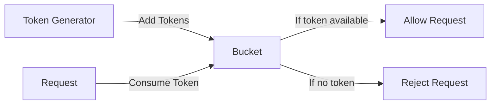
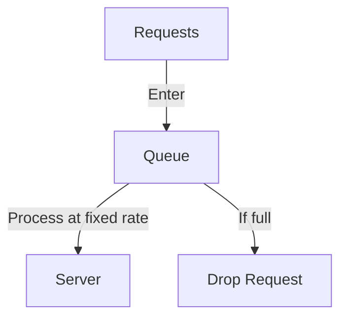
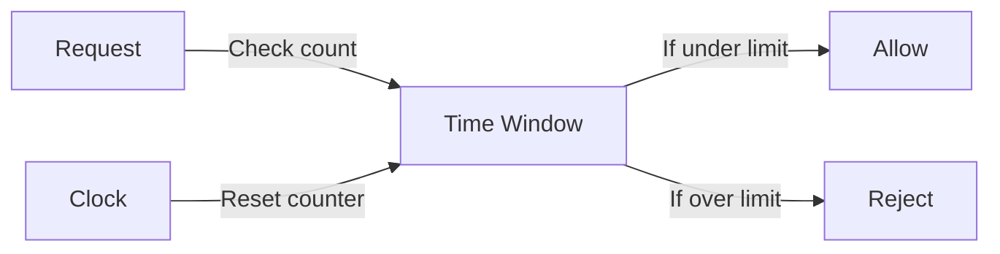
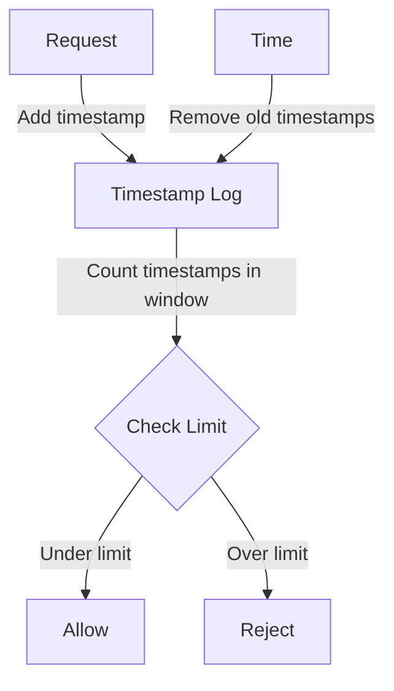
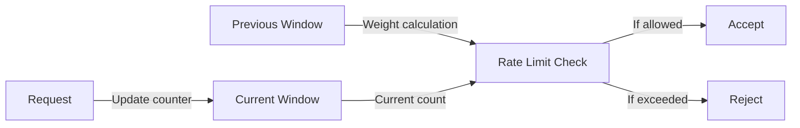
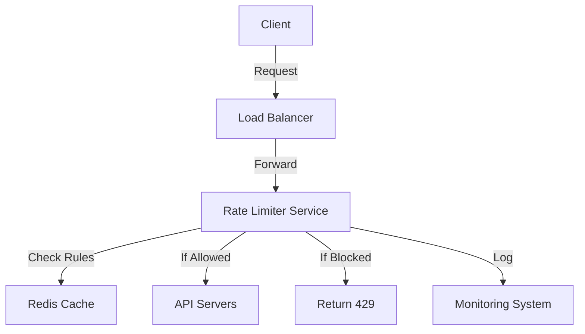

# API Rate Limiter System Design

## Table of Contents
1. [Introduction](#introduction)
2. [Rate Limiting Algorithms](#rate-limiting-algorithms)
   - [Token Bucket Algorithm](#token-bucket-algorithm)
   - [Leaking Bucket Algorithm](#leaking-bucket-algorithm)
   - [Fixed Window Counter](#fixed-window-counter)
   - [Sliding Window Log](#sliding-window-log)
   - [Sliding Window Counter](#sliding-window-counter)
3. [Requirements](#requirements)
   - [Functional Requirements](#functional-requirements)
   - [Non-Functional Requirements](#non-functional-requirements)
4. [Architecture](#architecture)
   - [High-Level Design](#high-level-design)
   - [Component Design](#component-design)
5. [Data Model](#data-model)
6. [Implementation](#implementation)
7. [Optimization](#optimization)
8. [References](#references)

---

## Introduction
A Rate Limiter is a crucial component in any large-scale distributed system that helps control the rate of traffic sent by a client or a service. It acts as a gatekeeper that ensures fair usage of resources and prevents system overload. Rate limiting is commonly used to:
- Prevent resource starvation caused by Denial of Service (DoS) attacks
- Reduce costs by limiting API usage
- Prevent server overload
- Create different tiers of API access

## Rate Limiting Algorithms

### Token Bucket Algorithm


The Token Bucket algorithm is one of the most popular rate limiting algorithms. It works as follows:
- A token bucket is a container that has pre-defined capacity
- Tokens are added to the bucket at a fixed rate
- Each request consumes one token
- If bucket is empty, new requests are rejected

**Pros:**
- Allows for burst traffic up to bucket size
- Simple to implement
- Memory efficient
- Can handle varying rates by adjusting token refill rate

**Cons:**
- Need to tune bucket size and refill rate carefully
- May allow too much burst traffic if not configured properly
- Token generation can be skewed if system time is not synchronized

### Leaking Bucket Algorithm


Leaking Bucket is similar to Token Bucket but processes requests at a fixed rate:
- Requests are added to a FIFO queue
- Queue has a fixed size (the bucket size)
- Requests are processed at a fixed rate
- If queue is full, new requests are dropped

**Pros:**
- Provides stable outflow rate
- Good for smoothing out bursty traffic
- Memory efficient due to fixed queue size

**Cons:**
- Less flexible than Token Bucket
- Can be unfair to bursty traffic
- Fixed processing rate may not be ideal for all scenarios

### Fixed Window Counter


Fixed Window Counter is the simplest rate limiting algorithm:
- Divides timeline into fixed windows
- Each window maintains a counter
- Counter is incremented for each request
- Counter is reset at the start of each window

**Pros:**
- Very simple to implement
- Memory efficient
- Works well for simple rate limiting needs

**Cons:**
- Can allow twice the rate limit if requests cluster around window boundaries
- Not suitable for precise rate limiting
- Requires time synchronization across nodes

### Sliding Window Log


Sliding Window Log maintains a sorted set of timestamps:
- Each request timestamp is logged
- Window "slides" with current time
- Count timestamps in current window
- Remove timestamps outside window

**Pros:**
- Very accurate
- No boundary conditions issues
- Handles burst traffic well

**Cons:**
- High memory usage
- Computationally expensive
- Not suitable for high throughput systems

### Sliding Window Counter


Sliding Window Counter combines Fixed Window and Sliding Log:
- Maintains counter for current window
- Uses weighted previous window counter
- Smooths out boundary conditions
- More memory efficient than Sliding Log

**Pros:**
- Good balance between accuracy and performance
- Handles boundary conditions well
- Memory efficient compared to Sliding Log

**Cons:**
- More complex to implement
- Requires additional computation for weight
- May need time synchronization

## Requirements

### Functional Requirements
1. **Rate Limiting Rules:**
   - Limit requests based on various criteria (IP, user ID, API key)
   - Support different time windows (per second, minute, hour, day)
   - Configure different limits for different API endpoints

2. **Request Processing:**
   - Accept or reject incoming requests based on limits
   - Return appropriate HTTP status codes (429 Too Many Requests)
   - Provide remaining quota information in response headers

3. **Rule Management:**
   - Add/modify/delete rate limiting rules
   - Support for different types of limits (concurrent, rolling window)

### Non-Functional Requirements
1. **Performance:**
   - Low latency (< 1ms) for rate limit decisions
   - Handle high throughput (thousands of requests per second)
   - Minimal impact on API response times

2. **Scalability:**
   - Horizontal scalability for distributed systems
   - Handle increasing number of rules and clients
   - Support for multiple data centers

3. **Reliability:**
   - High availability (99.99%)
   - Consistent rate limiting across distributed systems
   - Graceful degradation under heavy load

4. **Accuracy:**
   - Precise tracking of request counts
   - Minimal false positives/negatives
   - Accurate time window management

## Architecture

### High-Level Design


### Component Design
1. **Rate Limiter Service:**
   - Rule evaluation engine
   - Counter management
   - Response handling

2. **Cache Layer (Redis):**
   - Store counters and rules
   - Handle distributed synchronization
   - Provide atomic operations

3. **Configuration Service:**
   - Manage rate limiting rules
   - Handle rule updates
   - Distribute configuration

4. **Monitoring System:**
   - Track rate limit hits
   - Alert on anomalies
   - Provide usage analytics

## Data Model

### Rule Configuration
```json
{
  "rule_id": "string",
  "resource": "string",
  "type": "user|ip|api_key",
  "window": "number",
  "window_unit": "second|minute|hour|day",
  "limit": "number",
  "algorithm": "token_bucket|leaky_bucket|sliding_window"
}
```

### Counter Storage
```json
{
  "key": "resource:identifier",
  "window_start": "timestamp",
  "counter": "number",
  "last_updated": "timestamp"
}
```

## Implementation
The implementation details and code examples can be found in the [implementation folder](../DesignRateLimiter/implementations/).

Key implementation considerations:
1. Use of distributed cache (Redis) for counter storage
2. Atomic operations for counter updates
3. Efficient data structures for different algorithms
4. Error handling and fallback mechanisms
5. Performance optimization techniques

## Optimization

### Performance Optimizations
1. **Caching:**
   - Local caching of rules
   - In-memory counters for high-frequency endpoints
   - Cache warm-up strategies

2. **Batching:**
   - Batch counter updates
   - Bulk rule loading
   - Asynchronous logging

3. **Algorithm Selection:**
   - Use Token Bucket for general purpose
   - Sliding Window Counter for accuracy
   - Fixed Window for simple cases

### Distributed System Optimizations
1. **Synchronization:**
   - Use of distributed locks
   - Eventual consistency for counters
   - Clock synchronization

2. **Scalability:**
   - Horizontal scaling of rate limiter service
   - Partitioning of counter storage
   - Load balancing strategies

## References
1. [AWS API Gateway Rate Limiting](https://docs.aws.amazon.com/apigateway/latest/developerguide/api-gateway-request-throttling.html)
2. [Redis Rate Limiting Pattern](https://redis.io/commands/incr#pattern-rate-limiter)
3. [Stripe Rate Limiting](https://stripe.com/blog/rate-limiters)
4. [Cloudflare Rate Limiting](https://www.cloudflare.com/rate-limiting/)
5. [Kong Rate Limiting Plugin](https://docs.konghq.com/hub/kong-inc/rate-limiting/)
