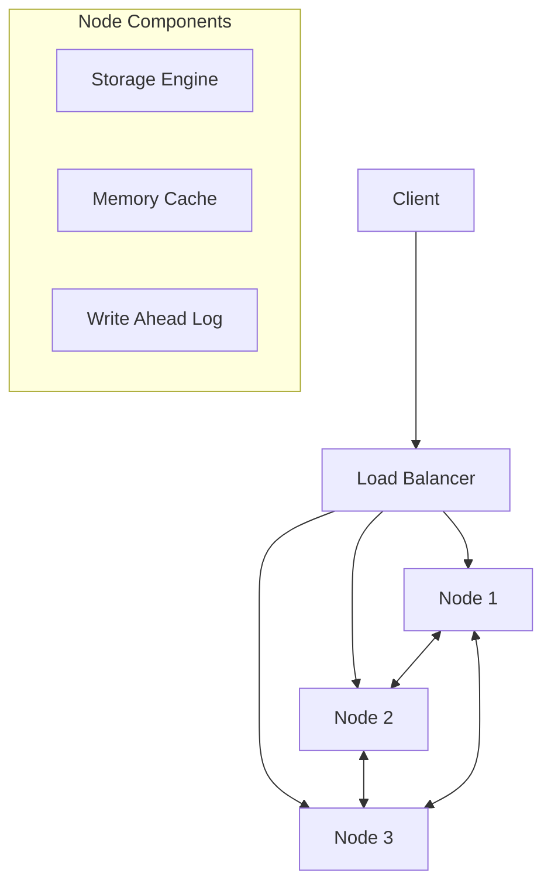

# Distributed Key-Value Store Design

## Table of Contents
1. [Introduction](#introduction)
2. [Requirements](#requirements)
   - [Functional Requirements](#functional-requirements)
   - [Non-Functional Requirements](#non-functional-requirements)
3. [Simple In-Memory Key-Value Store](#simple-in-memory-key-value-store)
4. [CAP Theorem](#cap-theorum)
5. [Data Partitioning](#data-partitioning)
6. [Data Replication](#data-replication)
7. [Consistency Guarantees](#consistency-guarantees)
8. [Practical Implementation Guide](#practical-implementation-guide)
   - [System Architecture](#system-architecture-diagram)
   - [Quick System Limits](#quick-system-limits)
   - [Basic Node Implementation](#basic-node-implementation)
   - [Data Distribution](#data-distribution-implementation)
   - [Failure Detection](#failure-detection-and-recovery)
   - [Performance Optimizations](#performance-optimizations)
     - [Read Path](#read-path-optimization)
     - [Write Path](#write-path-optimization)
   - [Real-world Considerations](#real-world-considerations)
   - [Common Pitfalls](#common-implementation-pitfalls)
   - [Quick Start Usage](#quick-start-usage)

9. [References](#references)
   - [Core Concepts](#core-concepts)
   - [System Design](#system-design)
   - [Consensus & Replication](#consensus--replication)
   - [Real-world Implementations](#real-world-implementations)
   - [Performance & Optimization](#performance--optimization)

---

### Introduction
- A key-value storage system is a kind of NoSQL database system that stores data as collection of `key:value` pairs. Unlike relational DBs, this type of storage are schema-less.
- Examples:
    - `Redis`: In-memory data structure store, used as database, cache and message broker.
    - `DynamoDB`: NoSQL database used by almost all internal services at Amazon.
    - `Cassandra`: Distributed NoSQL database designed to handle large amount of data across many commodity servers.
    - `Memcached`: Distributed memory object caching system.

### Requirements
- `System design requirements` are basically some functional/non-functional contstraints that the system should operate under.
#### `Function Requirements:`
    - `PUT Operation:` store a key:value pair in the storage
    - `GET Operation:` retrieve the value for a given key

#### `Non-Functional Requirements:`
    - `Storage:` able to store large amount of data (let's assume amount of data not placable on one machine)
    - `Reliable:` There should be no SOPF (Single point of failure), and data should be reliably inserted into the system.
    - `Read Scalable:` should be able to accommodate sudden spike/increase in traffic.
    - `Availability:` should be available with minimal downtime and no SOPF.
    - `Eventual Consistency:` Read, issued right after write operation should not be guaranteed to return the latest value, this can present for a little but non-deterministic time.
    - can consider `Low Latency` and `Fault tolerance` also for this system.

### Simple In Memory Key-Value store
- Consider a key-value store resides on single server, and in memory is straightforward to implement. 
- In this, we have single OS process with in memory dictionary to store the data.
- `Benefits:`
    1. It's easy to implement.
    2. It's fast.
- `Drawbacks:` The main reason of this type of system is not good as they do not meet the non-functional requirements. There are high chances of SOPF in this type of system.
    - `Not reliable:` If server permanently dies, all the data is lost.
    - `Not Available:` If server temporarily dies, data is not accessible
    - `Not Scalable:` If sudden traffic spike occurs, there are high chances of it's crash as we are operating on Single OS process.

- All this problem has one major thing `Single Point of failure (SOPF)` which can be solved by distributing request into N operational points, this fail-over mechanism is called `Distributed system`.

### CAP theorum
- Read about it from [here](../../BasicConcepts/CAP_Theorum.md)

### Data Partitioning
- For Large scale applications, It is not feasible to store data on a single dB server as it will become slow or even worse at the end and storage space can also increase.
- The solution of this problem is `Data Partitioning: partition data into chunks and store them on multiple machines.`
- In this case evenly distribute data on different machines and add an application level logic follows 2 rules:
    1. Evenly distribute data b/w existing machines
    2. In case of machine failure or new machine addition, data should be re-distributed.

- So, this seems easy in theory, but it's little complex in implement it. To handle such kind of situations, a concept called `Consistent Hashing` is used. Read of it from [here](../../BasicConcepts/Consistent_Hashing.md) and [Basic implementation](../ConsistentHashing)

### Data Replication
- To achieve reliability and high availability, we need to get rid of SOPF from the system.
- One of the solution is `Data Replication: To have N copies of same data on N geographically distributed servers.` This will help us in loosing data in case of permanent/temporal machine failures.
- There are various variations of data replication like: `active-passive, active-active etc.`
- `active-active` are complex as they target scalability on write as well read operations.
- `active-passive:` this are ones which mostly focuses on read-heavy systems.
    - Here 1 master handles write operations node and N follower nodes handles all reads.
    - One of most popular implementation of this is `Raft consensus protocol`.

#### Raft consensus Algorithm
- This algorithm says
    - All the writes are handled by master node only. Each and every write command is considered successful if and only if the master node gets acknowledgement from majority of the follower nodes that they have written the data successfully.
    - Reads can be handled by any one of N follower nodes. Meaning we can have dynamic number of followers depending on the stress of system. one quite interesting side effects of replication is that we'll be able to place replicated geographically closer to the clients that issue bunch of read requests, thus decreasing actual latency for them.

- One tradeoff in this protocol is that atleast majority of the nodes should be up and running for giving acknowledgement. for ex: For N nodes, atleast `N/2 + 1` nodes should be up and running for the system to be operational. This is called `quorum`.
- More of raft algorithm can be read from [here1](https://raft.github.io/), and [here2](https://youtu.be/aE2UPg3Ckck).


### Consistency Guarantees
- Before this, watch [different types of conssistency video](https://youtu.be/Fm8iUFM2iWU). So, above replication techniques gives us high availability, reliability, and other benefits, but it can cause `potential inconsistency` between replicas.
The problem is of `Eventual Consistency`. 
As for example a write request is sent to master node, and master node gets confirmation from majority of the followers. 
Now, suppose read request comes and it is redirected to one of the follower node where data is not replicated yet, this may cause incosistency problem but for a system with high availability, this is acceptable for a small fraction of time.

### Practical Implementation Guide

#### System Architecture Diagram


#### Quick System Limits
- Max key size: 1KB
- Max value size: 1MB
- Target latency: < 10ms reads, < 50ms writes
- Replication factor: 3
- Consistency: Quorum (n/2 + 1)

#### Basic Node Implementation
```python
class StorageNode:
    def __init__(self):
        self.cache = LRUCache(size=1000)  # Hot data
        self.store = LSMTree()            # Persistent storage
        self.wal = WriteAheadLog()        # Durability

    async def get(self, key: str) -> bytes:
        # Check cache first
        if value := self.cache.get(key):
            return value
        # Read from disk
        return self.store.get(key)

    async def put(self, key: str, value: bytes) -> bool:
        # Write-ahead log first
        self.wal.append(key, value)
        # Update storage
        self.store.put(key, value)
        self.cache.put(key, value)
        return True
```

#### Data Distribution Implementation
```python
def get_node(key: str) -> Node:
    # Consistent hashing with virtual nodes
    hash_val = hash(key)
    return hash_ring.get_node(hash_val)
```

#### Failure Detection and Recovery
```python
# Node health check
async def is_healthy(node: Node) -> bool:
    try:
        await node.ping(timeout=1)
        return True
    except Exception:
        return False

# Basic failover
async def handle_node_failure(failed_node: Node):
    # 1. Remove from routing table
    hash_ring.remove_node(failed_node)
    # 2. Promote replica if primary
    if failed_node.is_primary:
        new_primary = select_new_primary()
        promote_to_primary(new_primary)
    # 3. Start recovery process
    start_background_recovery(failed_node)
```

#### Performance Optimizations

##### Read Path Optimization
```python
class ReadOptimizedNode:
    def get(self, key):
        # 1. Bloom filter check
        if not self.bloom.might_exist(key):
            return None
        # 2. Check cache
        if value := self.cache.get(key):
            return value
        # 3. Check SSTable indexes
        return self.store.get(key)
```

##### Write Path Optimization
```python
class WriteOptimizedNode:
    def put(self, key, value):
        # 1. Write to memtable
        self.memtable.put(key, value)
        # 2. If memtable full, flush to SSTable
        if self.memtable.size > THRESHOLD:
            self.flush_to_sstable()
```

#### Real-world Considerations

##### Performance Best Practices
- Use Bloom filters to avoid unnecessary disk reads
- Implement batch writes for better throughput
- Compress values before storage
- Keep frequently accessed keys in memory

##### Reliability Measures
- Implement write-ahead logging
- Add checksums for data blocks
- Regular compaction to manage space
- Implement incremental backups

##### Key Monitoring Metrics
```python
# Essential metrics to track
metrics = {
    'read_latency_p99': '10ms',
    'write_latency_p99': '50ms',
    'cache_hit_rate': '80%',
    'storage_used': '80%',
    'replication_lag': '100ms'
}
```

#### Common Implementation Pitfalls
1. Not handling hot keys properly (use caching)
2. Poor compaction strategy (leads to write amplification)
3. Storing large values (use blob store instead)
4. Missing rate limiting (can cause cascading failures)

#### Quick Start Usage
```python
# Initialize store with nodes
kv_store = DistributedKVStore(nodes=['node1:6379', 'node2:6379'])

# Write with quorum consistency
await kv_store.put('user:123', value, consistency='QUORUM')

# Read with quorum consistency
value = await kv_store.get('user:123', consistency='QUORUM')

# Batch operations for better performance
await kv_store.batch_put([
    ('key1', 'value1'),
    ('key2', 'value2')
])
```

---
### References

#### Core Concepts
- [CAP Theorem](../../BasicConcepts/CAP_Theorem)
- [Consistent Hashing](../../BasicConcepts/Consistent_Hashing.md)
- [Consistent Hashing Implementation](../../Questions/ConsistentHashing/)
- [Different Types of Consistency](https://youtu.be/Fm8iUFM2iWU)

#### System Design
- [Distributed Key-Value Store Design](https://youtu.be/VKNIhztQnbY?list=PL6W8uoQQ2c63W58rpNFDwdrBnq5G3EfT7)
- [How to Design a Distributed Key-Value Store](https://nikasakana.medium.com/how-to-design-a-distributed-key-value-store-cfd83248541b)
- [Key-Value Store System Design](https://youtu.be/LnqKfLcszEg)

#### Consensus & Replication
- [Raft Consensus Algorithm](https://raft.github.io/)

#### Real-world Implementations
- [DynamoDB Paper](https://www.allthingsdistributed.com/files/amazon-dynamo-sosp2007.pdf)
- [Cassandra Architecture](https://cassandra.apache.org/doc/5.0/cassandra/architecture/index.html)
- [Redis Documentation](https://redis.io/documentation)
- [Memcached Wiki](https://github.com/memcached/memcached/wiki)

#### Performance & Optimization
- [LSM Trees and RocksDB](https://github.com/facebook/rocksdb/wiki/RocksDB-Overview)
- [Bloom Filters](https://llimllib.github.io/bloomfilter-tutorial/)
- [Distributed Systems Consistency Models](https://jepsen.io/consistency)

